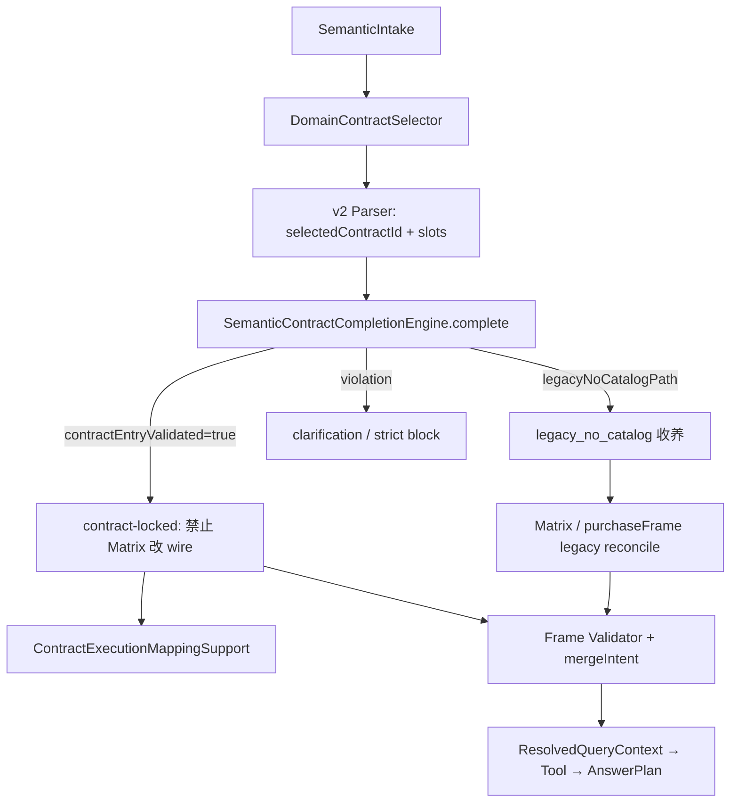

# Contract-Entry Validation — P2 阶段收口

> **状态：Current Baseline（语义合同主链）**
> 本文虽为 P2 阶段收口，但其中 `SemanticIntake → DomainContractSelector → V2 selectedContractId → SemanticContractCompletionEngine.complete() → contractEntryValidated → Tool / AnswerPlan` 的合同主链和红线仍为当前修改基线。若早期 observe-only / strict-mode 规划文档与本文冲突，以本文、`.cursor/rules/harness-java-boundary.md` 与当前代码事实为准。
>
> **Current 补充**：V2 之后 Java 没有重新选择业务合同的权力。Completion 成功后，任何 support 都不得修改 `selectedContractId`、canonical wire、`answerPlanType` 或 `selectedTools`；后置冲突只能澄清、失败或 known gap。

> **阶段**：D-CONTRACT-ENTRY-VALIDATION-P2
> **日期**：2026-05
> **范围**：语义主链 contract-entry 落地状态盘点；**不含** Tool / SQL / AnswerPlan / Composer 改动。
> **关联**：[`harness-composer-architecture.md`](./harness-composer-architecture.md) §1b、[`semantic-contract-strict-mode-plan.md`](./semantic-contract-strict-mode-plan.md)

---

## 1. 红线（P2 起持续有效）

1. **主语义链**必须以 **SemanticIntake → DomainContractSelector → selectedContractId → ACTIVE contract entry → contractEntryValidated → Tool / AnswerPlan** 为主。
2. **禁止**新增 Java 根据用户原文、`contains`、`rankingType`、slots 形状**反推业务语义**并覆盖主链。
3. **禁止**为单个 case 恢复旧 **Router / FollowUpRewrite / Matrix 主导**逻辑。
4. Matrix / `rankingType` / slots→wire 在 P2 只能是 **legacy / debug / 非 contract-locked 收养**，不得主导已 validated 的主链。

---

## 2. 当前主链顺序

```text
用户问句
  → SemanticIntake LLM（semantic_intake.v1）
       canonicalUserQuery + intakePrimaryDomain + intakeStatus
  → DomainContractSelector（Java：按 intakePrimaryDomain 注入单域 allowedOutputContract）
  → query_semantic_parser.v2（LLM：selectedContractId + semanticSlots）
  → SemanticAdoptionPipeline
       SemanticContractCompletionEngine.complete()
         · 校验 selectedContractId ∈ allowedContracts
         · 命中 ACTIVE SemanticCapabilityContract
         · 槽位与合同帧对齐
         · 成功 → contractCompletionTrace.contractEntryValidated = true
         · 无 allowed contracts → legacyNoCatalogPath（legacy_no_catalog 收养）
       · contractLocked ? 跳过 Matrix reconcile : reconcileSemanticSlotsViaCapabilityMatrices（legacy）
       · Purchase 专用 purchaseFrameAdoption（仅非 contractLocked 且满足采购 frame 条件）
       · BasicDomainContractEntryAdoption（REVENUE / STOCK_REDUCE / WAREHOUSE，contractLocked 或显式 route signal）
  → SemanticContractValidationPipeline / StrictDecision
  → AiQuerySemanticLlmMergeHelper.mergeIntent
       · contractLocked 时 ContractExecutionMappingSupport 提供 intent/path/tools
  → AiResolvedQueryContext
  → Tool → AnswerPlan → Composer
```

代码入口：`AiResolvedQueryContextResolver` → `SemanticAdoptionPipeline` → `SemanticContractCompletionEngine` → `ContractExecutionMappingSupport`。



---

## 3. contract-locked 唯一判定

| 概念 | 判定 | 说明 |
|------|------|------|
| **contract-locked** | `contractCompletionTrace.contractEntryValidated == true` | `SemanticContractCompletionEngine.isContractLockedParse()` ≡ `isContractEntryValidated()` |
| **仅有 selectedContractId** | **不算** lock | LLM 输出合同 id 但未通过 `complete()` 槽位/ACTIVE 校验时，主链仍视为未锁定 |
| **legacy_no_catalog** | `contractCompletionTrace.legacyNoCatalogPath == true` | Catalog 无 allowed entries 时 passThrough；`SemanticAdoptionPipeline` 打 `adoptionPath: legacy_no_catalog` |
| **execution mapping** | 仅 contract-locked | `ContractExecutionMappingSupport.resolve(sem)` 在 `!isContractLockedParse` 时返回 null |

设置 validated 的唯一成功路径：`SemanticContractCompletionEngine.complete()` 找到 **ACTIVE** 合同且槽位校验通过，trace 写入 `contractEntryValidated=true`（及 execution metadata）。

---

## 4. Matrix / rankingType / slots→wire 的 P2 定位

| 机制 | P2 角色 | contract-locked 行为 |
|------|---------|----------------------|
| `*SemanticCapabilityMatrix.resolveStructuredIntentDetailWire` | legacy 收养：非 locked 时 slots/问句形状对齐 wire | 各域 Matrix **入口 return null / abstain**（采购/营收/出库/库房/菜品/诊断均已加 guard） |
| `AiQuerySemanticSlotMerge.reconcileSemanticSlotsViaCapabilityMatrices` | legacy 全链 reconcile | **入口即短路**：仅保留 currentTurn wire，不调用各域 reconcile |
| `AiQuerySemanticLlmMergeHelper.apply*StructuredWireFromSemanticSlots` | mergeIntent 前 legacy 收口 | 各 apply 方法首行 `isContractLockedParse` → return |
| `metric.rankingType` | **debug-only**（Harness / StrictBlocker 观测） | `AiQuerySemanticLlmMergeHelper.warehouseStructuredWireFromMetricRankingType` 仍存在于 **非 locked** 库房路径 — **P3 待移除** |
| `BusinessDiagnosisSemanticCapabilityMatrix.resolveRowFromMessage` | **LEGACY_ONLY** 完整问法 contains | contract-locked 时 `resolveStructuredIntentDetailWire` 不调用 |
| `Revenue/DishSales inferMatrixWireFromNormalizedQuestion` | **LEGACY_ONLY** 问句 contains | 仅非 locked 分支 |

**不得**把「Matrix 行命中」「rankingType 兼容」「slots 形状推断」当作与 `contractEntryValidated` 等价的 lock 依据。

---

## 5. Catalog 域总览（8 域均已注册 Exporter）

注册表：`SemanticContractCatalog` → 各 `*SemanticCapabilityContractExporter`。

### 5.1 BUSINESS_OVERVIEW（P2E）

| 状态 | contractId | 说明 |
|------|------------|------|
| **ACTIVE** | `business_overview.summary` | 四域经营概览汇总 |
| **ACTIVE** | `business_overview.status` | 经营状态 |
| **ACTIVE** | `business_overview.store_status_compare` | 门店状态对比 |
| KNOWN_GAP | — | 无（Matrix 首轮 3 行均无 knownGap） |

contract-locked：`LlmMergeHelper.applyBusinessOverviewStructuredWireFromSemanticSlots` 已 guard；Matrix 类本身尚无内部 `isContractLockedParse`（依赖上层短路，见 §7 TODO）。

### 5.2 BUSINESS_DIAGNOSIS（P2H）

| 状态 | contractId |
|------|------------|
| **ACTIVE** | `business_diagnosis.summary` |
| **ACTIVE** | `business_diagnosis.problem_summary` |
| **ACTIVE** | `business_diagnosis.risk_summary` |
| **ACTIVE** | `business_diagnosis.suggestion_summary` |
| **ACTIVE** | `business_diagnosis.store_risk_reasons_inherited` |
| **ACTIVE** | `business_diagnosis.store_risk_reasons_named` |
| **KNOWN_GAP** | `business_diagnosis.store_priority_ranking` — `BUSINESS_DIAGNOSIS_EXTENDED_NOT_IN_P2H` |
| **KNOWN_GAP** | `business_diagnosis.store_compare` — 同上 |
| **KNOWN_GAP** | `business_diagnosis.store_domain_purchase` — `DIAGNOSIS_CHILD_DOMAIN_PLAN_MISSING_PURCHASE` |
| **KNOWN_GAP** | `business_diagnosis.store_domain_stock_reduce` — `DIAGNOSIS_CHILD_DOMAIN_PLAN_MISSING_STOCK_REDUCE` |
| **KNOWN_GAP** | `business_diagnosis.store_domain_dish_profit` — `DIAGNOSIS_CHILD_DOMAIN_PLAN_MISSING_DISH_PROFIT` |

Matrix contract-locked guard：已覆盖 `resolveStructuredIntentDetailWire` / `resolveRow` / `rowFromActiveContractId`。

### 5.3 DISH_SALES（P2G）

| 状态 | contractId |
|------|------------|
| **ACTIVE** | `dish_sales.overview` |
| **ACTIVE** | `dish_sales.count_ranking_high` |
| **ACTIVE** | `dish_sales.amount_ranking_high` |
| **ACTIVE** | `dish_sales.count_ranking_low` |
| **ACTIVE** | `dish_sales.single_dish` |
| **ACTIVE** | `dish_sales.store_count_ranking` |
| **ACTIVE** | `dish_sales.store_single_dish` |
| **KNOWN_GAP** | `dish_sales.cross_domain_profit` |
| **KNOWN_GAP** | `dish_sales.trend` |

### 5.4 DISH_PROFIT（P2G）

| 状态 | contractId |
|------|------------|
| **ACTIVE** | `dish_profit.overview` |
| **ACTIVE** | `dish_profit.ranking_low_margin` |
| **ACTIVE** | `dish_profit.ranking_high_margin` |
| **ACTIVE** | `dish_profit.ranking_high_profit_amount` |
| **ACTIVE** | `dish_profit.ranking_low_profit_amount` |
| **ACTIVE** | `dish_profit.gross_margin_rate` |
| **ACTIVE** | `dish_profit.ranking_high_actual_cost` |
| **KNOWN_GAP** | `dish_profit.ranking_max_cost_gap` |
| **KNOWN_GAP** | `dish_profit.low_profit_reason` |
| **KNOWN_GAP** | `dish_profit.theoretical_cost` |
| **KNOWN_GAP** | `dish_profit.actual_outbound_cost` |
| **KNOWN_GAP** | `dish_profit.cost_gap` |
| **KNOWN_GAP** | `dish_profit.ingredient_cost_breakdown_first_turn` |
| **KNOWN_GAP** | `dish_profit.dish_anchor_ingredient_breakdown`（follow-up 行） |

### 5.5 PURCHASE（P2F）

| 状态 | contractId |
|------|------------|
| **ACTIVE** | `purchase.goods_anchor.source_breakdown` |
| **ACTIVE** | `purchase.goods_anchor.supplier_breakdown` |
| **ACTIVE** | `purchase.goods_anchor.supplier_unit_price` |
| **ACTIVE** | `purchase.overview_summary` |
| **ACTIVE** | `purchase.self_overview` |
| **ACTIVE** | `purchase.supplier_overview` |
| **ACTIVE** | `purchase.goods_amount_ranking` |
| **ACTIVE** | `purchase.goods_count_ranking` |
| **ACTIVE** | `purchase.supplier_amount_ranking` |
| **ACTIVE** | `purchase.store_amount_ranking` |
| **ACTIVE** | `purchase.anomaly.price` |
| **ACTIVE** | `purchase.anomaly.frequency` |
| **ACTIVE** | `purchase.anomaly.quantity` |
| **ACTIVE** | `purchase.anomaly.amount_spike` |
| **KNOWN_GAP** | `purchase.store_compare` |
| **KNOWN_GAP** | `purchase.store_pair_amount_compare` |
| **KNOWN_GAP** | `purchase.risk.stock_reduce_mismatch` |
| **Catalog 观测** | `goods_anchor_supplier_breakdown_missing_contract`（summary marker，非独立合同行） |

非 contract-locked 时仍保留 **purchaseFrameAdoption**（Matrix + `PurchaseCurrentSemanticFrameValidator`）；contract-locked 时走 completion 帧 + 跳过 Matrix reconcile。

### 5.6 REVENUE（P2B）

| 状态 | contractId |
|------|------------|
| **ACTIVE** | `revenue.overview` |
| **ACTIVE** | `revenue.store_amount_ranking` |
| **ACTIVE** | `revenue.single_store_overview` |
| **KNOWN_GAP** | `revenue.store_compare` |
| **KNOWN_GAP** | `revenue.period_compare` |
| **KNOWN_GAP** | `revenue.daily_amount_ranking` |
| **KNOWN_GAP** | `revenue.trend` |
| **PLANNED** | `revenue.dine_in_overview`, `revenue.takeout_overview`, `revenue.platform_ranking`, `revenue.order_count_overview`, `revenue.customer_count_overview`, `revenue.average_order_value`, `revenue.channel_breakdown` |

### 5.7 STOCK_REDUCE（P2B）

| 状态 | contractId |
|------|------------|
| **ACTIVE** | `stock_reduce.overview` |
| **ACTIVE** | `stock_reduce.store_amount_ranking` |
| **ACTIVE** | `stock_reduce.production_overview` |
| **ACTIVE** | `stock_reduce.waste_overview` |
| **ACTIVE** | `stock_reduce.loss_overview` |
| **ACTIVE** | `stock_reduce.return_overview` |
| **ACTIVE** | `stock_reduce.goods_amount_ranking` |
| **KNOWN_GAP** | `stock_reduce.goods_waste_ranking` |
| **PLANNED** | `stock_reduce.produce_output`, `stock_reduce.goods_count_ranking` |

### 5.8 WAREHOUSE（P2B）

| 状态 | contractId |
|------|------------|
| **ACTIVE** | `warehouse.overview` |
| **ACTIVE** | `warehouse.goods_amount_ranking_high` |
| **ACTIVE** | `warehouse.goods_amount_ranking_low`（仅账面剩余金额升序排行；≠ 库存偏少/报警） |
| **ACTIVE** | `warehouse.store_amount_ranking` |
| **ACTIVE** | `warehouse.single_store_overview` |
| **KNOWN_GAP** | `warehouse.out_of_stock` |
| **KNOWN_GAP** | `warehouse.near_expiry` |

---

## 6. contractEntryValidated 后绕开 Matrix 推导（P2 已落地）

| 域 | Matrix wire 推导 guard | Slot reconcile guard | Frame / adoption |
|----|------------------------|----------------------|------------------|
| PURCHASE | `PurchaseSemanticCapabilityMatrix` 多处 | `reconcileSemanticSlotsViaCapabilityMatrices` 总入口 + 采购子 reconcile | contractLocked → 非 purchaseFrameAdoption；locked 时 `PurchaseCurrentSemanticFrameValidator` |
| REVENUE | `RevenueSemanticCapabilityMatrix.resolveStructuredIntentDetailWire` | 同上 + `reconcileRevenueSemanticSlots` 仅在非 locked 链内 | `BasicDomainContractEntryAdoptionSupport` |
| STOCK_REDUCE | `StockReduceSemanticCapabilityMatrix` | 同上 | 同上 |
| WAREHOUSE | `WarehouseSemanticCapabilityMatrix` | 同上 | 同上 |
| DISH_SALES | `DishSalesSemanticCapabilityMatrix` | `reconcileDishSalesSemanticSlots` 等带 guard | `CurrentSemanticFrameValidatorRegistry` |
| DISH_PROFIT | `DishProfitSemanticCapabilityMatrix` | 同上 | 同上 |
| BUSINESS_DIAGNOSIS | `BusinessDiagnosisSemanticCapabilityMatrix` | `reconcileBusinessDiagnosisSemanticSlots` 带 guard | 同上 |
| BUSINESS_OVERVIEW | Matrix **无**内部 guard | 依赖总入口 `reconcileSemanticSlotsViaCapabilityMatrices`；`LlmMergeHelper` apply 已 guard | `CurrentSemanticFrameValidatorRegistry` |

**legacy_no_catalog**：当 Step 2 allowed contracts 为空，`complete()` passThrough 并设 `legacyNoCatalogPath`；收养路径标记 `adoptionPath: legacy_no_catalog`，仍可能走 Matrix reconcile（**无 ACTIVE catalog 的域/场景**）。

---

## 7. P2 子阶段交付摘要

| 子阶段 | 域 | 交付要点 |
|--------|-----|----------|
| P2B | REVENUE / STOCK_REDUCE / WAREHOUSE | Exporter ACTIVE/KNOWN_GAP/PLANNED；`BasicDomainContractEntryAdoptionSupport`；Matrix contract-locked guard |
| P2E | BUSINESS_OVERVIEW | 3 条 ACTIVE 合同；Exporter + Matrix 首轮行 |
| P2F | PURCHASE | goods-anchor + 主流程 overview/ranking/anomaly ACTIVE；KNOWN_GAP 门店排行/风险 |
| P2G | DISH_SALES / DISH_PROFIT | 主流程 overview/排行/单菜毛利率 ACTIVE；扩展行标 KNOWN_GAP |
| P2H | BUSINESS_DIAGNOSIS | 概览/问题/风险/建议/门店原因 ACTIVE；子域归因与扩展排行 KNOWN_GAP |

P2 **未做**：Tool/SQL/AnswerPlan/Composer 改造；FollowUpRewrite 删除后的 intake 补全能力扩展；KNOWN_GAP 合同的主链放行。

---

## 8. 下一阶段 TODO（P3+，**不在 P2 继续改**）

### 8.1 主链一致性 / 技术债（仅记录，P2 未改代码）

- [ ] **Intake schema v2 — `followUpIntent`**：将裸维度切换 `_to_*_ranking` 等 wire token 从 `reason` 迁至独立字段（`targetMetric` / `targetDomain` / `targetContractId`）；Java 停止 parse `reason` 字符串。见 [`semantic-intake-schema-evolution.md`](semantic-intake-schema-evolution.md)。
- [ ] **BUSINESS_OVERVIEW Matrix 内部 guard**：`BusinessOverviewSemanticCapabilityMatrix.resolveStructuredIntentDetailWire` 与其他域对齐，首行 `isContractLockedParse` → abstain。
- [ ] **移除问句 contains 推导**：`RevenueSemanticCapabilityMatrix.inferMatrixWireFromNormalizedQuestion`、`DishSalesSemanticCapabilityMatrix.inferMatrixWireFromNormalizedQuestion`、`BusinessDiagnosisSemanticCapabilityMatrix.resolveRowFromMessage` — 仅保留 Harness legacy 或删除。
- [ ] **移除 rankingType 路由**：`AiQuerySemanticLlmMergeHelper.warehouseStructuredWireFromMetricRankingType`（已有 P4 TODO 注释）。
- [ ] **purchaseFrameAdoption 收敛**：非 contract-locked 采购路径仍全量 Matrix reconcile；评估是否改为「仅 legacy_no_catalog / 显式 fallback」。
- [ ] **selectedContractId 未 validated 的 Strict 行为**：strict mode 下对「有 id 无 validated」的统一 clarification 策略（见 strict-mode plan）。
- [ ] **ContractExecutionMappingSupport 全链消费**：确保 Planner/Agent 在 contract-locked 时不再读 Matrix planType。

### 8.2 KNOWN_GAP 合同产品化（按域分批，需 AnswerPlan/Tool 配套）

- [ ] BUSINESS_DIAGNOSIS：子域归因三合同 + store_priority_ranking + store_compare
- [ ] DISH_PROFIT：扩展排行、诊断 detail、原料构成首轮、菜锚 follow-up
- [ ] DISH_SALES：cross_domain_profit、trend
- [ ] REVENUE：compare/trend/daily ranking + PLANNED 细分 overview
- [ ] WAREHOUSE：out_of_stock、near_expiry
- [ ] STOCK_REDUCE：goods_waste_ranking + PLANNED 行
- [ ] PURCHASE：store_amount_ranking、stock_reduce_mismatch、supplier_breakdown catalog 绑定

### 8.3 观测与文档

- [ ] Harness Replay 面板：区分 `selectedContractId` vs `contractEntryValidated` vs `adoptionPath`
- [ ] 更新 `harness-composer-architecture.md` 链路透传 P2 收口链接（可选）
- [ ] 各域 answer-plan 文档与 ACTIVE contractId 对照表（只读索引）

---

## 9. 关键代码索引

| 职责 | 类 |
|------|-----|
| contract 完成与 lock 判定 | `SemanticContractCompletionEngine` |
| ACTIVE 合同聚合 | `SemanticContractCatalog` |
| 单域 allowed contracts | `DomainContractSelector` |
| 收养与 legacy 分叉 | `SemanticAdoptionPipeline` |
| validated → execution | `ContractExecutionMappingSupport` |
| Matrix reconcile 总闸 | `AiQuerySemanticSlotMerge.reconcileSemanticSlotsViaCapabilityMatrices` |
| 基础三域 frame 收养 | `BasicDomainContractEntryAdoptionSupport` |
| 主解析入口 | `AiResolvedQueryContextResolver` |

---

*本文档为 P2 阶段收口快照；后续以 Catalog Exporter 与 `SemanticContractCompletionEngine` 源码为准。*
