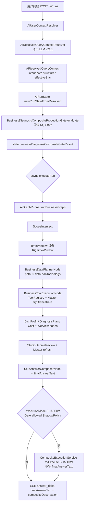

# 主链路经营路由与 Composite Gate/Execution 集成映射（**D-2.1** + **D-2.2 交叉索引**）

> **读者**：后端 / Harness 工程师。  
> **依据**：仓库内 **现行 Java**（以阅读时为准），不修改代码。  
> **相关文档**：[`business-diagnosis-production-gate-design.md`](./business-diagnosis-production-gate-design.md)，[`business-diagnosis-production-composite-execution-design.md`](./business-diagnosis-production-composite-execution-design.md)，[`business-question-routing-d2-design.md`](./business-question-routing-d2-design.md)。

---

## 1. 用户发起问题后主链路：入口 → 终稿

### 1.1 HTTP 入口

| 步骤 | 代码位置 | 说明 |
|------|-----------|------|
| **POST `/ai/runs`** | `com.nongxinle.controller.AiRunController#createRun` | 接收 `AiRunCreateRequest`（`userId`、`message`、`conversationId`、`departmentId`/`distributerId` 等）。 |
| **启动 Run** | `com.nongxinle.ai.platform.AiRunService#startRun` | 校验、必要时建会话；`nextRunId()`；**同步**完成解析与 Gate 观测后注册 `AiRunSession`，**异步** `executeRun(runId)`。 |

不存在单独的 “chat” Controller 分叉：本轮业务 **标准入口**即为 **`AiRunController` + `AiRunService`**（若别处封装同请求体，仍归一到此）。

### 1.2 用户上下文（非 LLM）

| 步骤 | 代码位置 | 说明 |
|------|-----------|------|
| **用户上下文** | `AiRunService.startRun` → `AiUserContextResolver#resolve(req)` | 角色、部门等鉴权上下文，供 Resolver / Tool 使用。 |

### 1.3 LLM / 语义解析发生在哪里

**唯一解析入口**：`com.nongxinle.ai.resolver.AiResolvedQueryContextResolver#resolve(...)`。

| 组件 | 作用 |
|------|------|
| **`AiQuerySemanticLlmParser`** | 在用户消息上做 **语义 LLM 解析（v2）**：`parse(SemanticParserInput)`；Resolver 内再经归一化与采纳；**无总开关关闭路径**。 |
| **v2 语义主链** | **`AiQuerySemanticLlmParser`** 解析后由 Resolver **`trySemanticAdoption`** 直接采纳（D-1X-B：已移除 Resolver 内 legacy Normalizer / DishProfitGate）。 |
| **上一轮记忆** | `AiConversationMemoryService#load` → `AiConversationTurnMemory`，供语义合并与 Harness 日志。 |

**明示**： Resolver 注释写明 **显式时间**来自语义 LLM / 多轮合并，**不对用户话术做 Java 关键词时间解析**。这与 **Gate**、**D-2 路由文档**「禁止用户原文 contains/regex 路由」一致。

### 1.4 `intent` / `path` / `structuredIntentDetail` / `effectiveIntentCode` / `effectivePathCode` 在哪里生成

| 字段 | 主要生成阶段 |
|------|----------------|
| **`AiResolvedQueryIntent`**（`intentCode`、`pathCode`、`structuredIntentDetail`、`topic`、…） | Resolver 将 **语义采纳结果**与规则合并写入 **`AiResolvedQueryContext.queryIntent`**（见 `AiResolvedQueryContextResolver` 内 `mergedIntent`、`trySemanticAdoption` 之后装配）。 |
| **`structuredIntentDetail`（wire）** | 来自 **LLM 解析 + Lexicon canonical**；后续 **Gate** 再用 `AiQuerySemanticLexicon.canonicalStructuredIntentDetailWire(...)`。 |
| **`effectiveIntentCode` / `effectivePathCode`**（及 **`effectiveTimeWindowSource`**、**`effectiveScopeSource`**、**`effectiveIntentSource`**） | Resolver 在构建 **`AiResolvedQueryContext`** 时根据 **`AiFollowUpResolution`** 等写好（见 Resolver 中段 `AiResolvedQueryContext.builder()` 及对 `followUp.getEffectiveIntentCode()` 一类赋值）。  
| **图上旧「追问节点」** | 已移出主图；追问合并由 **Resolver + conversation memory** 在 Graph 前完成。 |

因此：**effective\*** 在 **进入 Graph 之前**已由 Resolver **定稿**；Gate 在 `startRun` 内读取的 **`AiResolvedQueryContext`** 与后续 **DataPlanner** 看到的是 **同一版**上下文（主图首个节点为 **ScopeIntersect**，不再经过 no-op 追问节点）。

### 1.5 `AiResolvedQueryContext` 与 `AiRunState`：创建与挂载

| 时机 | 代码 | 说明 |
|------|------|------|
| **创建 Context** | `AiResolvedQueryContextResolver.resolve(...)` | 返回完整 **`AiResolvedQueryContext`**。 |
| **创建 State** | `AiRunService#newRunStateFromResolved` | `AiRunState.builder().resolvedQueryContext(resolved)...build()`；`needClarification` ← `resolved.isNeedSemanticClarification()` 等。 |
| **Gate 观测写入** | `AiRunService#recordCompositeProductionGateObservation` | 调用 **`BusinessDiagnosisCompositeProductionGate.evaluate(rq, state, effectiveEnabled)`**，将 **`BusinessDiagnosisCompositeGateResult`** 设为 **`state.setBusinessDiagnosisCompositeGateResult`**。 |
| **持久 Turn 记忆（完成后）** | `AiRunService#executeRun` 成功末尾 | **`AiConversationMemoryService.rememberCompletedTurn`**、**`AiFollowUpIntentSnapshotSupport.snapshotFromCompletedState`** + **`followUpConversationMemory.remember`** —— 供 **下一轮** Resolver 加载。 |

**注意**：Gate **evaluate** 本体 **不修改** **`AiRunState`**（见 `BusinessDiagnosisCompositeProductionGate` 注释）；仅 **调用方** `AiRunService` 把 **结果对象**挂上 State。

### 1.6 `AiGraphRunner`：Business 线性节点链（路径选择不靠 Master 单独一节）

配置：`com.nongxinle.ai.config.AiBusinessGraphConfig#businessAgentNodes`。

**顺序（与 Bean 注释一致）**：

1. **`BusinessScopeIntersectNode`** — 范围求交。  
2. **`BusinessTimeWindowNode`** — 将 **`AiResolvedQueryContext.timeWindow`** 镜像到 **`statStartDate` / `statEndDate`**（与 **`effectiveTimeWindowSource`** 一致）；**不**再对用户话术调用 **`AiUserQueryTimeWindowResolver`**。缺省窗时与本锚点 **本月至今** 兜底。  
3. **`BusinessDataPlannerNode`** — **核心路由**：读取 **`effectivePathCode`**（及澄清位），设置 **`AiRunState`** 上一组 **boolean path 标志**与 **`dataPlanTools`**（`AiBusinessToolIds` 列表）。若不澄清，按 path 勾选 **purchase / revenue / dish / stock / diagnosis / overview / warehouse / cost** 等支线。  
4. **`BusinessToolExecutionNode`** — 按 **`dataPlanTools`** 调 **`ToolRegistry`** 与各 **\*ToolExecutor**；并对 **营收/采购/出库/菜品/经营概览多域**调用 **`MasterBusinessAgent`** 的 `tryOrchestrate*`（见下）。  
5. **`StubOutcomeReviewNode`** — 审核桩 + **`MasterBusinessAgent.refreshBusinessOverviewMultiAgentPlanIfApplicable`**、诊断/计划 Builder 等。  
6. **`StubAnswerComposerNode`** — **终稿**：`LlmGateway` + 确定性渲染等，写入 **`AiRunState.finalAnswerText`**（及部分结构化 DTO）。

（**`BusinessWorkspaceRouteNode` / `BusinessFollowUpIntentResolveNode` / `WorkspaceRouterService` / `AiWorkspaceAccessGuard`** 等类已从代码删除，见 **`docs/legacy-reference/workspace-keyword-route-and-guard.md`**；**`AiUserQueryTimeWindowResolver` / LLM 时间 JSON 解析器** 随旧单 Agent Chat 已删除；Harness 时间唯一定稿见 **`AiResolvedQueryContext` + `BusinessTimeWindowNode`**。）

**`MasterBusinessAgent` 在哪里**：**不**作为独立 Graph 顶点；嵌入 **`BusinessToolExecutionNode`**（多域编排）与 **`StubOutcomeReviewNode`**（刷新计划）。**分支选择**的一手来源仍是 **Resolver 上下文 + DataPlannerNode 对 path 的解释**。

### 1.7 Tool / AnswerPlan / Composer 位置小结

| 环节 | 位置 |
|------|------|
| **Tool 执行** | 主要在 **`BusinessToolExecutionNode`**（`ToolRegistry.execute` / 专线 Executor）。 |
| **AnswerPlan 类产物** | 各 Planner/Builder 在 **Tool 节点之后**的子节点挂载（如 **`BusinessDiagnosisPlanNode`**、`DiagnosisPlanBuilder` 在 **OutcomeReview** 等）。 |
| **用户可见自然语言** | **`StubAnswerComposerNode`** → **`finalAnswerText`**；SSE **`answer_delta`** 在 **`AiRunService.executeRun`** 从 **`endedState.getFinalAnswerText()`** 取出发布。 |

---

## 2. `BusinessDiagnosisCompositeProductionGate` 当前挂接关系

### 2.1 调用点

| 调用方 | 方法 | 时机 |
|--------|------|------|
| **`AiRunService#startRun`** | `recordCompositeProductionGateObservation(state, null)` | **`resolvedQueryContextResolver.resolve` 之后**、**`asyncExecutor.executeRun` 之前**。 |
| **`AiRunService#executeBusinessGraphSyncForHarness`** | `recordCompositeProductionGateObservation(state, override)` | Harness **同步**跑图前，同样 **紧接 Resolver 之后**。 |
| **`AiHarnessReplayCompositeGate`**（Harness） | `BusinessDiagnosisCompositeProductionGate.evaluate(ctx, scenario.runState(), flag)` | **仅 Gate 回放**：不跑 Resolver / Planner / Tool（见该类 Javadoc）。 |

### 2.2 Gate 是否只读 `AiResolvedQueryContext`

**是。** `BusinessDiagnosisCompositeProductionGate.evaluate(AiResolvedQueryContext, AiRunState, boolean)` **只读**：

- **`AiResolvedQueryContext`**（intent/path/structured、时间、org、orchestration、**`mentionedDishName`** 等）；  
- **`AiRunState`** **仅读** **`isNeedClarification()`**（不写在 Gate 内 mutating State）。

**写入**发生在 **`AiRunService`**：把 **`BusinessDiagnosisCompositeGateResult`** 存到 **`AiRunState.businessDiagnosisCompositeGateResult`**。

### 2.3 是否改变原有 Graph / DataPlanner 路由

**否。** Gate **不**参与 `BusinessDataPlannerNode` 分支选择；**不**跳过、不插入节点。当前作用：

- **计算** `allowed` / `reasonCode` / `recommendedCaseKind` / `debug`；  
- 供 **SSE**（`AiHarnessResolvedContextSummarizer.summarizeCompositeGateAndExecutionOnly`）与 **SHADOW/Harness Composite 执行**前置判断。

### 2.4 「只做观测？」— 分两截

| 维度 | 说明 |
|------|------|
| **对 legacy 终稿** | **是观测优先**：默认 **不替换** **`finalAnswerText`**。 |
| **对 Composite 执行** | **`allowed`** + **ExecutionMode** 决定是否 **真实跑** **`BusinessDiagnosisCompositeExecutionService.tryExecute`**。 |

### 2.5 `SHADOW` / `HARNESS_ONLY` / `PRIMARY` 现行状态（代码语义）

枚举：`com.nongxinle.ai.planner.BusinessDiagnosisCompositeExecutionMode`（**OFF | HARNESS_ONLY | SHADOW | PRIMARY**）。

| 模式 | 行为（代码） |
|------|----------------|
| **HARNESS_ONLY** | 仅 **`AiRunService.maybeExecuteHarnessCompositePlanner`**：**在 **`graphRunner.runBusinessGraph` 成功结束后**调用 **`businessDiagnosisCompositeExecutionService.tryExecute(..., mode=HARNESS_ONLY)`**。**不写入** **`finalAnswerText`**。Harness 请求经 **`executeBusinessGraphSyncForHarness`** 传入 **`compositeBusinessDiagnosisExecutionMode`**。 |
| **SHADOW** | **`AiRunService.maybeExecuteShadowCompositePlanner`**：条件包括 **`compositeBusinessDiagnosisProductionEnabled`**、Spring **`ai.composite.businessDiagnosis.executionMode`** 解析为 **SHADOW**、**Gate.allowed**、**`ShadowPolicy.evaluate`**。**在 legacy Graph 完成之后**旁路 **`tryExecute(..., SHADOW)`**；异常 **吞掉**；**不写** **`finalAnswerText`**；写入 **`compositeShadow*`** 观测字段。  
| **`PRIMARY`** | **`BusinessDiagnosisCompositeExecutionService.tryExecute`** **仅允许** **`HARNESS_ONLY`** 与 **`SHADOW`**；对 **`PRIMARY`** **直接返回** **未执行**的 **`BusinessDiagnosisCompositeExecutionResult`**（**不接**替换主回答逻辑）。注释：**PRIMARY 尚不接生效逻辑**。 |
| **OFF** | Harness 路径：`HARNESS_ONLY` 以外 → **不跑** CompositePlanner。普通 Run：`executionMode` 非 **SHADOW** → **`maybeExecuteShadowCompositePlanner`** 早退。 |

**配置占位（源代码默认值）**：`AiRunService` 上 **`ai.composite.businessDiagnosis.executionMode` 默认 `SHADOW`**；**`ai.composite.businessDiagnosis.productionEnabled` 默认 `true`**（若环境未覆盖）。

---

## 3. 若未来让 Composite **进入生产主回答**：插入点与设计约束

本节 **仅为架构建议**，**非**当期实现。

### 3.1 推荐插入层次

| 方案 | 位置 | 评价 |
|------|------|------|
| **A（推荐评审）** | **Resolver 之后、legacy Tool 执行之前**：若 **Gate allowed** 且产品选择 **PRIMARY（未来）**，**短路**跳过 **`BusinessToolExecutionNode` 中与四域重复的 Tool**，改为 **仅此一条** **`BusinessDiagnosisCompositeExecutionService`** 跑四域 Adapter。 | 与 **`business-diagnosis-production-gate-design.md`** 「Gate 在四域 Tool 之前」一致；**避免双倍 IO**。 |
| **B（现状 SHADOW/HARNESS）** | **整图跑完后**再 **`tryExecute`**。 | **已落地**；**必重复跑**四域 Tool（legacy 一遍 + Composite 一遍），仅可接受 **影子/离线**。 |
| **C（不推荐）** | **仅用 GraphRunner 之后替换文本**且不跳过 Tool。 | **成本最高**：三次（legacy Tool + Composite + 可选 Composer），仅适合过渡期灰度观测。 |

### 3.2 如何避免重复跑四域 Tool

- **同一 Run 内**若 **PRIMARY**：DataPlanner **不得**再给 **`revenue_query`/`purchase_overview`/`stock_reduce_query`/`dish_profit_analysis`** 填进 **`dataPlanTools`**（或由 **编排旗标**跳过 **`BusinessToolExecutionNode`** 对应段落），**仅**由 **`PlannerExecutor` + RealBridge** 拉数。  
- **需与设计**：**「Composite 成功与否 → 是否 fallback legacy」** **失败策略**（避免无回答）。

### 3.3 如何保证单域仍走单域

- **Gate** 已用 **`effectiveIntentCode` / `effectivePathCode`** 拒绝单域（`DOMAIN_SINGLE_INTENT_NOT_COMPOSITE`）及排行 / 点名菜等；将来 **PRIMARY** 也必须沿用同一 **Gate** 判定，禁止仅靠配置强行 Composite。
- **DataPlanner** 应继续完全由 **Resolver path**驱动；**不得**在未扩展 **语义层**时用 **contains/regex** **把单域升格** **Composite**。

### 3.4 如何保证用户第一句话仍由原有 LLM/语义层判断

- **PRIMARY** **不得**在未跑 **`AiResolvedQueryContextResolver`** 的情况下进入 Composite。**语义层**仍为 **intent/path/structured** 唯一来源 **（与 Gate 对齐）**。  
- **若**在 **Tool 之前**短路：仍可保留 **StubAnswerComposer** 的职责分工 —— **要么** Composite **Readonly Composer** **直接**作为主 **`finalAnswerText`** 来源，**要么**规定 **不写**第二轮 LLM 叙事（产品决策）。

---

## 4. 流程图（Mermaid）

### 4.1 普通 Run（`/api/ai/runs`）— 语义 / Gate / Legacy / SHADOW Composite



### 4.2 文本等价（便于检索）

```text
用户 POST /ai/runs
  → AiUserContextResolver
  → AiResolvedQueryContextResolver（语义 LLM，产出 intent/path/structuredIntentDetail、effectiveIntentCode/effectivePathCode、…）
  → new AiRunState(resolvedQueryContext)
  → BusinessDiagnosisCompositeProductionGate.evaluate → businessDiagnosisCompositeGateResult（仅观测 + 后续 Composite 前置）
  → [异步] AiGraphRunner：
        ScopeIntersect → TimeWindow（镜像 AiResolvedQueryContext.timeWindow）
      → BusinessDataPlannerNode（effectivePath → dataPlanTools / path flags）
      → BusinessToolExecutionNode（Tools + MasterBusinessAgent 编排）
      → … → StubAnswerComposerNode → finalAnswerText
  → [若 SHADOW 且 Gate 放行且 ShadowPolicy OK] Composite tryExecute（再跑 PlannerExecutor + 四域 RealBridge）
  → SSE（legacy finalAnswerText + Gate/Execution/compositeShadow* 摘要）
```

---

## 5. 文档结尾汇总

### 5.1 当前 **已安全接入** 的点

- **解析后 Gate 观测**：`AiRunService.startRun` / Harness 同步入口内 **`BusinessDiagnosisCompositeProductionGate.evaluate`** → **`AiRunState.businessDiagnosisCompositeGateResult`**。  
- **SSE 信封**：**`compositeGate*`** + **`compositeExecution*`**（及 SHADOW **`compositeShadow*`**）经 **`AiHarnessResolvedContextSummarizer`**、`AiRunService.envelopePutCompositeGateAndExecution`。  
- **Harness `HARNESS_ONLY`**：`executeBusinessGraphSyncForHarness` 结束后 **`maybeExecuteHarnessCompositePlanner`**。  
- **普通 Run `SHADOW`**：`maybeExecuteShadowCompositePlanner`：**Gate + ShadowPolicy** 成立后 **`tryExecute`**，**不改变** **`finalAnswerText`**。  
- **Gate-only Harness**：`**AiHarnessReplayCompositeGate`** 可单独验收 Gate **不触发** Resolver/Tool。

### 5.2 **尚未接入** **生产主回答** 的点

- **`PRIMARY`**：**`BusinessDiagnosisCompositeExecutionService`** **不接** **`PRIMARY`** 执行语义；**无主链路** **`finalAnswerText`/`answerPreview`** **替换**。  
- **无前插短路**：现行 **Composite** **总在** legacy **Tool + Composer **之后 **（或对 Harness 在同序尾部）**，**未**去掉 **legacy 四域**重复执行。  
- **Gate **未**反向驱动 **`BusinessDataPlannerNode`** **省略**分支（**routing** **仍**完全是 ** Resolver + DataPlanner 原逻辑）。

### 5.3 **D-2.2** — 主链路路由验收表（权威落地在同名路由设计文档 **§10**）

**完整表**（16 类问法 + `expectedIntentCode` / `expectedPathCode` / `expectedStructuredIntentDetail` / `expectedScopeType` / Gate `allowed` / `reasonCode` / `finalRouteTarget`）见：

- **[`business-question-routing-d2-design.md` §10](./business-question-routing-d2-design.md#d22-main-route-acceptance-table)**（含 **§10.1** 验收前提、**§10.4** 与 **§9** 联动的语义缺口）。

与本主链路图的 **对齐关系**简述：

| 节点（本文 §1～§4） | 验收表怎么用 |
|---------------------|---------------|
| **§1.3–1.4** Resolver、`effectiveIntentCode`/`effectivePathCode`/`structuredIntentDetail` | 表中各 **`expected*`** 列 **与 Resolver 产出一致**后，再对 Gate / `COMPOSITE` 做验收。 |
| **§1.5** `recordCompositeProductionGateObservation` | 表中 **expectedCompositeGateAllowed** / **expectedGateReasonCode** 对齐 **`BusinessDiagnosisCompositeProductionGate.evaluate`**。**Gate 不扫描用户原文**；**Composite Planner 亦不直接消费用户话术**——只依赖已物化的 **`AiResolvedQueryContext`**。**禁止**为用例 **新增 Java `contains`/regex 分叉**来做路由。 |
| **§1.6 `BusinessDataPlannerNode`** | `finalRouteTarget` 中非 **`COMPOSITE`** 的列（REVENUE / PURCHASE / …）对应 **legacy path 勾选 + Tool/Cost/Diagnosis/Overview 支线**的实际主链路。 |

若 **wire/path 与表中 expected 系统性对不上**：先在 **`business-question-routing-d2-design.md` §10.4（及 §9）** 登记 **语义缺口**，**不擅自改 Gate/Resolver/Java**（本条为文档验收约定）。

### 5.4 若要做「最小代码改动」的 PRIMARY/去重备选（仍为设计勾选，本轮不落地）

1. **PRIMARY 占位（最小触碰）**：在 `AiRunService.executeRun` 末尾，若配置为 PRIMARY、Gate `allowed`、`tryExecute` 成功，则把 `AiRunState.finalAnswerText` 设为 Composite `composeResult.finalAnswerText`（外加 feature flag / 租户白名单）；否则保持 legacy。**不改 Resolver。**
2. **去重（次小改动）**：在 DataPlanner 前或内设 `compositePrimaryShortCircuit`（Gate + 开关）：若为 true，则从 `dataPlanTools` 去掉与 Composite 四步等价的 Tool id，并让 Tool 节点跳过对应执行，仅跑一次 `CompositeExecutionService.tryExecute`。**改动面大于 (1)**，但可根除双倍 Tool IO。
3. **观测对齐**：PRIMARY 接管终稿时在 SSE payload 增加 `compositeFinalAnswerSource=PRIMARY` 一类字段，避免与 legacy 并行展示混淆。

---

## 6. 参考类路径速查

| 概念 | 包路径 |
|------|--------|
| Run 入口 | `com.nongxinle.controller.AiRunController` |
| Orchestration | `com.nongxinle.ai.platform.AiRunService` |
| Resolver | `com.nongxinle.ai.resolver.AiResolvedQueryContextResolver` |
| Graph 列表 | `com.nongxinle.ai.config.AiBusinessGraphConfig` |
| Graph 执行器 | `com.nongxinle.ai.core.AiGraphRunner` |
| Composite Gate | `com.nongxinle.ai.planner.BusinessDiagnosisCompositeProductionGate` |
| Composite Execution | `com.nongxinle.ai.planner.BusinessDiagnosisCompositeExecutionService` |
| Execution 模式枚举 | `com.nongxinle.ai.planner.BusinessDiagnosisCompositeExecutionMode` |
| Shadow 灰度 | `com.nongxinle.ai.planner.ShadowPolicy` |

---

**文档版本**：D-2.1 v1 + **D-2.2 §5.3** 验收表索引（2026-05-14）；与当时仓库源代码阅读结果一致。**问法 ↔ Gate ↔ 终链路对表**以 **[`business-question-routing-d2-design.md` §10](./business-question-routing-d2-design.md#d22-main-route-acceptance-table)** 为准。
