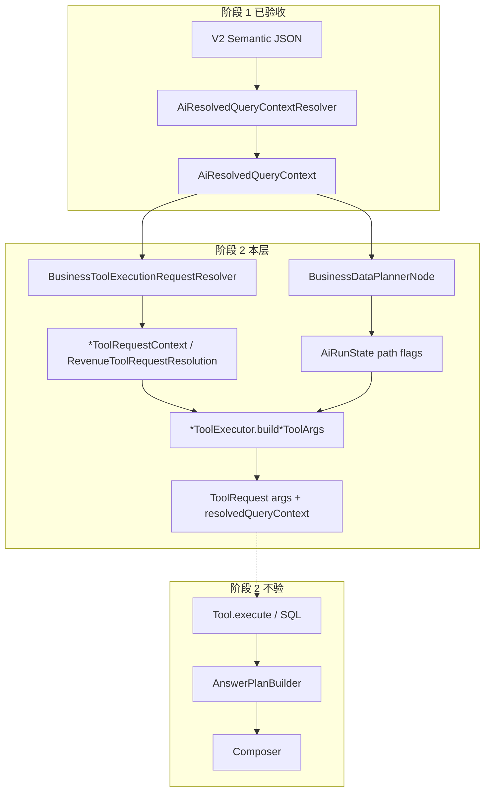

# 阶段 2：Tool Request / SQL 入参层 — 现状链路与实施方案

> **状态**：规划文档（2026-05-19）；**不改代码**，仅梳理现状与验收边界。  
> **上游**：阶段 1 已收口；主链见 [`semantic-allowed-output-contract-design.md`](./semantic-allowed-output-contract-design.md)。  
> **相关**：[`BusinessToolExecutionRequestResolver`](../src/main/java/com/nongxinle/ai/graph/business/toolrequest/BusinessToolExecutionRequestResolver.java)、[`AiBusinessToolIds`](../src/main/java/com/nongxinle/ai/tool/business/AiBusinessToolIds.java)、[`AiHarnessReplayDryRunStage`](../src/main/java/com/nongxinle/ai/harness/replay/AiHarnessReplayDryRunStage.java)、Planner Adapter 设计（purchase / revenue / stock-reduce planner-adapter-design）。

---

## 1. 阶段 2 验收边界

### 1.1 目标

证明系统**准备用什么参数去查**（Tool 计划 + `ToolRequest.args` + SQL 绑定快照），与阶段 1 已稳定的 `AiResolvedQueryContext` **一致**，且不依赖查库结果是否正确。

### 1.2 在范围内

| 维度 | 典型断言对象 |
|------|----------------|
| **Tool 编排** | `dataPlanTools`、`purchaseOverviewPath` / `revenueOverviewPath` / `stockReduceQueryPath` / `businessOverviewPath`、`groupPurchaseOverview` / `groupStockReduceQuery` |
| **Resolver 快照 → 请求上下文** | `*ToolRequestContext` / `RevenueToolRequestResolution` 字段（时间、部门锚点、域 SQL ID、`resolutionDebug.*Source`） |
| **Wire → Tool args** | `startDate` / `stopDate`（=`ARG_START_DATE` / `ARG_STOP_DATE`）、`purchaseSourceFocus`、`purchaseNarrativeMode`、`stockReduceNarrativeMode`、`group*Aggregation`、`resolvedDepartmentIds` |
| **Scope 展开** | `queryScopeKind`、`queryStoreIds`、`expandedSqlDepartmentIds`、`purchaseSqlDepartmentIds` / `stockReduceSqlDepartmentIds` 与 Resolver `dataScope` 对齐 |
| **结构化子口径** | `queryIntent.structuredIntentDetail`（canonical wire）→ Tool narrative mode；采购 `purchaseSourceType` → `ARG_PURCHASE_SOURCE_FOCUS` |
| **Harness 探针（待增）** | `plannedToolArgsByToolId`、`toolRequestResolutionDebug`（见 §4） |

推荐配置：`dryRunStage=TOOL_REQUEST_ONLY`（**待实现**，见 §4）、`frozenClockDate` 固定、`replayMode=GRAPH_RUN` 或 Planner Hydrated；**不**断言 `toolResults` 行数值。

详细阶段 2 Harness case 矩阵见：[`docs/ai/phase2-tool-request-harness-matrix.md`](./phase2-tool-request-harness-matrix.md)

### 1.3 明确不在范围内

- Tool **返回行**、payload 是否为空、金额/排行是否正确  
- 任意业务数据 **SQL 文本**、Mapper 执行、DB 行数  
- **`AnswerPlan`**（`PurchaseAnswerPlan` / `DailyRevenueAnswerPlan` / `StockReduceAnswerPlan` 等）行集与 planType  
- **`Composer`** 文案、`finalAnswerText`、`answerPreviewContainsAnyOf`  
- 前端展示协议  

现有 `*_AGENT_GRAPH_CORE` case 中若仍断言 `usedTools` + `master*ToolResultSuccess` + `AnswerPlan` + 文案预览，属于**阶段 3+**；阶段 2 应拆出「仅入参」期望表或新 `caseId`。

### 1.4 与阶段 1 的 handoff

阶段 2 **不得**新增与 `semanticSlots.structuredIntentDetailWire` 平行的写口；入参层只读：

- `effectiveIntentCode` / `effectivePathCode`  
- `queryIntent.structuredIntentDetail`（Lexicon canonical 后）  
- `queryIntent.purchaseSourceType`  
- `timeWindow` / `effectiveTimeWindowSource`  
- `orgScope` + `dataScope`  

`metric.rankingType`、`metric.stockReduceType` 仅作 **debug/deprecated**（见 [`semantic-allowed-output-contract-design.md`](./semantic-allowed-output-contract-design.md)、[`semantic-contract-strict-mode-plan.md`](./semantic-contract-strict-mode-plan.md)）。

---

## 2. 现状主链路（Resolver → Tool Request）

### 2.1 生产 Graph 路径

1. **`AiHarnessReplayService`**：`dryRunStage != RESOLVED_CONTEXT_ONLY` 且 `replayMode=GRAPH_RUN` 时调用 `AiRunService.executeBusinessGraphSyncForHarness`。  
2. **`BusinessDataPlannerNode`**：读 `resolvedQueryContext.effectivePathCode`，设置 `dataPlanTools` 与 path 布尔位（如 `groupPurchaseOverview`、`groupStockReduceQuery`）。  
3. **`BusinessToolExecutionNode`**（或 **`MasterBusinessAgent`** 子 Agent）：  
   - 时间：优先 `rq.timeWindow` → 写入 `state.statStartDate` / `statEndDate`  
   - 部门：`ToolDepartmentResolutionSupport`  
   - 组装：`toolArgs()` 委托各 `*ToolExecutor.build*ToolArgs`  
   - 构建 **`ToolRequest`**（`args` + `resolvedQueryContext`）并 `execute`（阶段 2 拟在 execute 前截断）。  

### 2.2 Planner RealBridge 路径（已部分覆盖入参）

与生产 **同一套** Resolver + Executor，不经完整 Graph Composer：

| Bridge | Resolver 方法 | Executor args | Tool |
|--------|---------------|---------------|------|
| `PurchasePlannerRealReadBridge` | `buildPurchaseRequestContext` | `buildPurchaseOverviewToolArgs` | `purchase_overview` |
| `RevenuePlannerRealReadBridge` | `resolveRevenueToolRequest` | `buildRevenueQueryToolArgs` | `revenue_query` |
| `StockReducePlannerRealReadBridge` | `buildStockReduceRequestContext` | `buildHarnessToolArgs` | `stock_reduce_query` |

Harness case 如 `PLANNER_EXECUTOR_*_ADAPTER_REAL_BRIDGE_HYDRATED_CORE` 已跑真实 Tool（含 SQL）；阶段 2 可复用其 **Hydrated `AiResolvedQueryContext` 构造**，但断言改为 **args 快照** 而非 `AnswerPlan`。

### 2.3 `queryDepartmentIds` 说明

- **`AiResolvedQueryContext` 顶层无 `queryDepartmentIds`**。  
- Harness 摘要中的 **`expandedSqlDepartmentIds`** / **`effectiveSqlDepartmentIds`** / 域别名 **`purchaseSqlDepartmentIds`** 等来自 **`AiResolvedDataScope`**。  
- Planner DTO（`PurchasePlannerReadRequest.queryDepartmentIds` 等）为 **Adapter 校验切片**，与 Tool `args` 的 `ARG_RESOLVED_DEPARTMENT_IDS`（门店根整型列表）相关但 **不是同一对象**。  
- **禁止**把 `expandedSqlDepartmentIds` 当「门店名称列表」对外解释（见 [`AI_HARNESS_REPLAY_CASES.md`](../AI_HARNESS_REPLAY_CASES.md)）。

---

## 3. 分域：toolId、Request DTO、字段来源

公共时间解析（四域一致）：`BusinessToolExecutionRequestResolver#resolveStartDateIso` / `resolveEndDateIso`  
→ 优先 `resolvedQueryContext.timeWindow`（含 `timeLabel` 结构化落成）；回退 `AiRunState.statStartDate` / `statEndDate`。

公共部门锚点：`ToolDepartmentResolutionSupport` + `BusinessScopeResolutionSupport.extractVisibleStoreRootDepartmentIds` + `dataScope` 回退链（见各类 `resolutionDebug.departmentAnchorSource`）。

---

### 3.1 采购（Purchase）

| 项 | 值 |
|----|-----|
| **path** | `purchase_overview_path` |
| **toolId** | `purchase_overview`（`AiBusinessToolIds.PURCHASE_OVERVIEW`） |
| **Request DTO** | `PurchaseToolRequestContext`；Wire：`ToolRequest` + `args` Map |
| **Resolver** | `BusinessToolExecutionRequestResolver#buildPurchaseRequestContext` |
| **Args 组装** | `PurchaseOverviewToolExecutor#buildPurchaseOverviewToolArgs` |

| 字段 | Tool args 键 / DTO 字段 | 来源 |
|------|-------------------------|------|
| **startDate / endDate** | `ARG_START_DATE` / `ARG_STOP_DATE`；DTO `startDateIso` / `endDateIso` | `resolvedQueryContext.timeWindow` → ISO；debug `timeWindowSource` |
| **queryDepartmentIds（SQL 展开）** | DTO `purchaseSqlDepartmentIds`、`effectiveSqlDepartmentIds`；集团分支 `ARG_RESOLVED_DEPARTMENT_IDS` | `dataScope.getSqlDepartmentIdsForDomain("purchase")`、`getEffectiveSqlDepartmentIds()` |
| **scope** | DTO `orgScopeType`、`queryScopeKind`；args `ARG_VISIBLE_STORES`、`ARG_QUERY_SCOPE_BANNER` | `orgScope.scopeType`；`dataScope.queryScopeKind`；`putPurchaseResolvedScopeArgs` |
| **purchaseSourceType** | DTO `purchaseSourceType`；args `ARG_PURCHASE_SOURCE_FOCUS` | **`queryIntent.purchaseSourceType`**（Resolver 自 semanticSlots.sourceFacet / metric 校准） |
| **structuredIntentDetailWire** | DTO `structuredIntentDetail`；args `ARG_PURCHASE_NARRATIVE_MODE` | **`queryIntent.structuredIntentDetail`**（canonical 自 **`semanticSlots.structuredIntentDetailWire`**）；经营诊断 path 可覆盖为 `purchase_overview_summary` |
| **集团聚合** | `ARG_GROUP_PURCHASE_AGGREGATION` | `AiRunState.groupPurchaseOverview`（`BusinessDataPlannerNode#applyPurchaseOverviewQuestionBranch` 按角色 + 可见门店数设置） |
| **锚 execution（D-13）** | `focusSupplierId`、`focusDisGoodsId`、`focusGoodsName` 等 | `PurchaseSemanticExecutionArgs.putIntoToolArgsIfApplicable(resolvedQueryContext)` |

---

### 3.2 营业额（Revenue）

| 项 | 值 |
|----|-----|
| **path** | `revenue_overview_path` |
| **toolId** | `revenue_query`（`AiBusinessToolIds.REVENUE_QUERY`） |
| **Request DTO** | `RevenueToolRequestResolution`；Wire：`ToolRequest` + `args` |
| **Resolver** | `BusinessToolExecutionRequestResolver#resolveRevenueToolRequest` |
| **Args 组装** | `RevenueQueryToolExecutor#buildRevenueQueryToolArgs` |

| 字段 | Tool args 键 / DTO 字段 | 来源 |
|------|-------------------------|------|
| **startDate / endDate** | `ARG_START_DATE` / `ARG_STOP_DATE`；DTO `startDateIso` / `stopDateIso` | 同上时间链 |
| **queryDepartmentIds** | DTO `expandedSqlDepartmentIds`、`visibleStoreRootDepartmentIds`；args `ARG_RESOLVED_DEPARTMENT_IDS`（集团/多店） | `dataScope.effectiveSqlDepartmentIds`；`orgScope.visibleStores[].storeDepartmentId` |
| **scope** | args `ARG_GROUP_WIDE_OVERVIEW_HINT`、`ARG_PARENT_STORE_COUNT`、`ARG_AI_ROLE_CODE` | `revenueOverviewPath` / `businessOverviewPath` / `businessDiagnosisPath` + 多 visible 店或 `shouldRouteGroupWideBusinessOverview` |
| **purchaseSourceType** | — | 营业额 Tool **不使用** |
| **structuredIntentDetailWire** | — | 营业额 Tool **无 narrative mode**；wire 仅影响 path / AnswerPlan（阶段 2 不验） |
| **stockReduceType** | — | — |

---

### 3.3 经营（Business Overview / 经营概览）

「经营」在现网分 **多条 path**，阶段 2 需分别验入参，不可混为单一 Tool。

#### 3.3.1 经营概览 `business_overview_path`（现网 MULTI_AGENT）

| 项 | 值 |
|----|-----|
| **Planner（现网）** | MULTI_AGENT → 四域子集；非 MULTI → **空 plan** |
| **MULTI_AGENT 子集（活跃，阶段 2 验入参）** | `revenue_query`、`purchase_overview`、`stock_reduce_query`、`dish_profit_analysis` |
| **收入侧（现网）** | 集团/单店均走 **`revenue_query`**（§3.2）：`ARG_DEPARTMENT_FATHER_ID`、日期；集团广角 **`ARG_GROUP_WIDE_OVERVIEW_HINT`** + **`ARG_RESOLVED_DEPARTMENT_IDS`**；依赖 `shouldRouteGroupWideBusinessOverview`（BTEN → **`revenue_query`**，非已删 overview Tool） |

各 Tool 入参走 **§3.2（revenue）/ §3.4（purchase、stock_reduce、dish_profit）** 及 `BusinessToolExecutionNode#toolArgs`；**不**再列 `business_overview_query` 参数表。

**Historical removed（classic + D-CLEAN-BOV-TOOL-DELETE）**：曾独立 Tool **`business_overview_query`** / **`BusinessOverviewQueryTool`**；典型已删链 **`business_overview_query` → `dish_sales_query` → `purchase_query` → `gross_margin_calculator`**（见 `docs/AI_MAINLINE_INDEX.md`）。阶段 2 **禁止** 把其 args 当作当前契约。

| toolId | 状态 | 说明 |
|--------|------|------|
| **`business_overview_query`** | **Historical removed** | 已从 `src/main` 删除；勿验 |
| **`purchase_query`** | **Historical removed（D-CLEAN-PURCHASE-QUERY-P2）** | 已删；成本链采购快照见 **`purchase_overview`** / §3.4 |
| ~~**`gross_margin_calculator`**~~ | **Historical removed（P2B）** | 毛利由 **`CostMarginDerivation`** 在 **`CostDiagnosisAgent`** 内推导；阶段 2 **禁止** 再验该 Tool |
| **`dish_sales_query`** | **Historical removed（D-CLEAN-DISH-SALES-P2）** | 已删 **`DishSalesQueryTool`**；D-8 **`DISH_SALES_QUERY` / `dish_sales_query_path`** 执行 **`dish_profit_analysis`**；阶段 2 **禁止** 再验该 Tool id |

#### 3.3.2 经营诊断 `business_diagnosis_path`（上层编排，仍属「经营」域）

| 项 | 值 |
|----|-----|
| **toolId 计划** | `DEFAULT_BUSINESS_DIAGNOSIS_TOOLS`：`purchase_overview`、`stock_reduce_query`、`dish_profit_analysis`（+ 可选 `revenue_query`） |
| **入参** | 各子域 Executor；采购/出库在 diagnosis 路径上对 **`ARG_PURCHASE_NARRATIVE_MODE` / `ARG_STOCK_REDUCE_NARRATIVE_MODE`** 强制 overview summary wire |
| **Request DTO** | 分域 `PurchaseToolRequestContext`、`StockReduceToolRequestContext`、`DishProfitToolRequestContext` |

阶段 2 对经营诊断：断言 **计划工具列表 + 各域 args 快照** 即可，**不**验 `DiagnosisPlan` / Composite Composer。

---

### 3.4 出库 / 核销（Stock Reduce）

| 项 | 值 |
|----|-----|
| **path** | `stock_reduce_query_path` |
| **toolId** | `stock_reduce_query`（`AiBusinessToolIds.STOCK_REDUCE_QUERY`） |
| **Request DTO** | `StockReduceToolRequestContext`；Wire：`ToolRequest` + `args` |
| **Resolver** | `BusinessToolExecutionRequestResolver#buildStockReduceRequestContext` |
| **Args 组装** | `StockReduceQueryToolExecutor#buildHarnessToolArgs`（`ARG_STOCK_REDUCE_HARNESS_PATH=true`） |

| 字段 | Tool args 键 / DTO 字段 | 来源 |
|------|-------------------------|------|
| **startDate / endDate** | `ARG_START_DATE` / `ARG_STOP_DATE` | 同上时间链 |
| **queryDepartmentIds** | DTO `stockReduceSqlDepartmentIds`；集团 `ARG_RESOLVED_DEPARTMENT_IDS` | `dataScope.getSqlDepartmentIdsForDomain("stock_reduce")` |
| **scope** | DTO `orgScopeType`、`queryScopeKind`；args `ARG_VISIBLE_STORES`、`ARG_QUERY_SCOPE_BANNER` | `orgScope` + `putStockReduceResolvedScopeArgs` |
| **purchaseSourceType** | — | — |
| **structuredIntentDetailWire** | DTO `structuredIntentDetail`；args `ARG_STOCK_REDUCE_NARRATIVE_MODE` | **`queryIntent.structuredIntentDetail`**；`goods_outbound_count_ranking` → canonical `goods_outbound_ranking` |
| **stockReduceType** | DTO `stockReduceType`（**compat**） | **`querySemanticParse.metric.stockReduceType`**；**不**覆盖 wire 主链 |
| **集团聚合** | `ARG_GROUP_STOCK_REDUCE_AGGREGATION` | `AiRunState.groupStockReduceQuery`（Planner 出库分支） |

---

## 4. `dryRunStage` 现状与最小新增建议

### 4.1 现状

[`AiHarnessReplayDryRunStage`](../src/main/java/com/nongxinle/ai/harness/replay/AiHarnessReplayDryRunStage.java) 仅两档：

| 值 | 行为 |
|----|------|
| **`RESOLVED_CONTEXT_ONLY`** | 只跑 Resolver + `AiHarnessResolvedContextSummarizer` + TurnMemory；**不**进 `executeBusinessGraphSyncForHarness` |
| **`FULL`** / `null` | 由 `replayMode` 决定是否全图（含 Tool execute、AnswerPlan、Composer） |

**不存在** `TOOL_REQUEST_ONLY` 或等价能力。  
[`AiHarnessReplayService`](../src/main/java/com/nongxinle/ai/harness/replay/AiHarnessReplayService.java) 第 124–126 行：`runBusinessGraphSync = GRAPH_RUN && dryRunStage != RESOLVED_CONTEXT_ONLY`。

Planner Executor mock 路径（`PLANNER_EXECUTOR_*`）走独立分支，**不是** Graph 上的「只组装 args」。

### 4.2 最小新增方案（建议）

**目标**：在 **不执行 SQL、不建 AnswerPlan、不调 Composer** 的前提下，产出可断言的 Tool 入参快照。

**方案 A（推荐）：扩展 `AiHarnessReplayDryRunStage.TOOL_REQUEST_ONLY`**

1. 枚举新增 `TOOL_REQUEST_ONLY`。  
2. `AiHarnessReplayService`：`GRAPH_RUN` + `TOOL_REQUEST_ONLY` 时调用 **`AiRunService.executeBusinessGraphSyncForHarnessUntilToolRequest`**（新方法）或现有 sync 图增加 **stopAfterNode=ToolExecution(pre-execute)** 钩子。  
3. 在 **`BusinessToolExecutionNode`**（或各 Executor）**execute 之前**：
   - 调用已有 `build*ToolArgs` / `buildPurchaseRequestContext`  
   - 写入 `AiRunState` 或 Harness 专用字段，如 `plannedToolArgsByToolId`  
4. **`AiHarnessResolvedContextSummarizer`**：Graph 摘要中摊平 `plannedToolArgsByToolId`、`toolRequestResolutionDebug`（来自 `*ToolRequestContext.resolutionDebug`）。  
5. **`AiHarnessExpectationComparator`**：新增可选字段比较（如 `expectedToolArgs.purchase_overview.startDate`）。

**方案 B（更小 diff、域受限）：Harness 专用 Resolver 探针**

不跑 Graph；Replay 在 `RESOLVED_CONTEXT_ONLY` 之后 **同轮** 构造轻量 `AiRunState`（path 旗标由 `effectivePathCode` 推导），仅调用 `BusinessToolExecutionRequestResolver` + `build*ToolArgs`，摘要合并到 `resolvedQueryContextSummary`。  

- **优点**：改动面小，可先覆盖四域单 Tool 专线。  
- **缺点**：不验 `DataPlanner` 的 `groupPurchaseOverview` 等与 Graph 分支；需与方案 A 互补。

**方案 C（已存在、但超出阶段 2 边界）：Planner Hydrated RealBridge**

继续用 `PLANNER_EXECUTOR_*_REAL_BRIDGE_HYDRATED_*`，在 Bridge 内 **`execute` 前** hook 导出 args（或 mock `ToolRegistry` 只记录 args）。实现快但 **耦合 Planner 路径**，不能替代生产 Graph 的 DataPlanner 旗标验收。

**建议落地顺序**：B（单域 4 条 smoke）→ A（与 `*_AGENT_GRAPH_CORE` 消息序对齐）→ 文档化矩阵 case。

详细阶段 2 Harness case 矩阵见：[`docs/ai/phase2-tool-request-harness-matrix.md`](./phase2-tool-request-harness-matrix.md)

---

## 5. 第一批建议验收 case

原则：**复用阶段 1 消息序** + **新增入参断言**；剥离 AnswerPlan / 文案 / `master*ToolResultSuccess`。

### 5.1 单域 Graph 核心（优先）

| caseId | 轮次要点 | 阶段 2 新增断言（示例） |
|--------|----------|-------------------------|
| **`PURCHASE_AGENT_GRAPH_CORE`** | 集团本月 → 集团上月 → AAA 本月 | R1/R2：`groupPurchaseOverview=true`，`purchase_overview` args 含 `groupPurchaseAggregation` + `resolvedDepartmentIds` 长度≥2；R3：单店 `departmentFatherId` + `purchaseNarrativeMode=purchase_overview_summary`；`startDate`/`stopDate` 与阶段 1 一致 |
| **`REVENUE_AGENT_GRAPH_CORE`** | 同上结构 | R1/R2：`groupWideOverviewHint` + 多店 `resolvedDepartmentIds`；R3：单店 `departmentFatherId`；日期对齐 |
| **`STOCK_REDUCE_AGENT_GRAPH_CORE`** | 同上结构 | R1/R2：`groupStockReduceAggregation`；R3：`stockReduceHarnessPath=true`、`stockReduceNarrativeMode=stock_reduce_overview`；**不**断言 reduce 金额 |
| **`BUSINESS_SEMANTIC_1B` 子集** | 从 1B 矩阵抽 R01/R04/R08 | 改 `dryRunStage=TOOL_REQUEST_ONLY`：`business_overview_path` → `dataPlanTools` 含 `revenue_query`+`purchase_overview`+`stock_reduce_query`+`dish_profit_analysis`（或子集）；验 **`revenue_query`** 日期/集团 hint（**Historical removed**：勿验 `business_overview_query`） |

### 5.2 结构化 wire / 来源 facet（采购 + 出库）

| caseId | 阶段 2 焦点 |
|--------|-------------|
| **`PURCHASE_SUPPLIER_RANKING_ANCHOR_EXECUTION_GOODS_UNIT_PRICE_3`** | R1：`purchaseNarrativeMode=supplier_amount_ranking`，`purchaseSourceFocus=SUPPLIER_PURCHASE`；R3：下钻 args 含 `focusSupplierId` / goods focus |
| **`PURCHASE_GOODS_RANKING_SOURCE_BREAKDOWN_2`** | `purchaseNarrativeMode=purchase_source_goods_query`，source focus 随 round 变化 |
| **`STOCK_REDUCE_SEMANTIC_1C` 抽 R05/R11** | `stockReduceNarrativeMode` = wire canonical（如 `goods_outbound_ranking`）；`stockReduceType` 仅 debug 可选 |

### 5.3 Planner Hydrated（快速 smoke，可选）

| caseId | 用途 |
|--------|------|
| `PLANNER_EXECUTOR_PURCHASE_ADAPTER_REAL_BRIDGE_HYDRATED_CORE` | STORE：args 与 `PurchaseToolRequestContext` 一致即可 **截断 execute** |
| `PLANNER_EXECUTOR_REVENUE_ADAPTER_REAL_BRIDGE_HYDRATED_CORE` | 同上 |
| `PLANNER_EXECUTOR_STOCK_REDUCE_ADAPTER_REAL_BRIDGE_HYDRATED_CORE` | 同上 |
| `PLANNER_EXECUTOR_PURCHASE_ADAPTER_GROUP_HYDRATED_CORE` | GROUP：`groupPurchaseOverview=true` args 形状 |

### 5.4 明确后置

- **`BUSINESS_DIAGNOSIS_V1_CORE_3`**、Composite Planner case：阶段 2 只验 **diagnosis 工具计划 + 三域 args**，不验 `DiagnosisPlan` / recommendation mock。  
- 全部 **`answerPreviewContainsAnyOf`**、`**AnswerPlan*` 探针：移至阶段 3。

---

## 6. 阶段 2 实施 checklist（后续 PR，本文档不执行）

详细阶段 2 Harness case 矩阵见：[`docs/ai/phase2-tool-request-harness-matrix.md`](./phase2-tool-request-harness-matrix.md)

1. [ ] 增加 `AiHarnessReplayDryRunStage.TOOL_REQUEST_ONLY` + Replay 分支  
2. [ ] Graph 或 Harness 探针：`plannedToolArgsByToolId` + `toolRequestResolutionDebug`  
3. [ ] `AiHarnessReplayExpectedRound` 扩展 `expectedPlannedToolArgs`（按 toolId 嵌套）  
4. [x] 新建 [`docs/ai/phase2-tool-request-harness-matrix.md`](./phase2-tool-request-harness-matrix.md)（分域 expected 表，对齐 1B/1C 矩阵写法）  
5. [ ] 脚本：`scripts/harness/replay-tool-request-core.sh`（四域 smoke）  
6. [ ] 从 `*_AGENT_GRAPH_CORE` **复制** expectations 为 `*_TOOL_REQUEST_CORE` variant，删除 AnswerPlan/文案断言  

---

## 7. 修订记录

| 日期 | 说明 |
|------|------|
| 2026-05-19 | 初版：阶段 2 边界、四域入参映射、`dryRunStage` 缺口、最小新增方案、第一批 case 建议。 |
