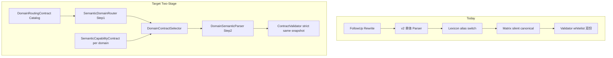

# Semantic Allowed Output Contract — Harness Engineering 设计

> **状态**：Router + ContractSelector + v2 parser + ContractValidator（observe-only）已接入主链；`semantic.contract.strict.enabled=false`（默认）；DomainSemanticParser 尚未全量替代 v2。  
> **日期**：2026-05-22  
> **目标**：**Domain Routing Contract（Step 1）** + **Domain SemanticCapabilityContract 小合同（Step 2）**，使 LLM 分阶段从已登记能力中选择域与 wire/slots。  
> **现网规则**：合同外 Parser 输出 → **不 Java 兜底归一、不猜、不补 semantic wire alias** → `model_contract_violation` / `unsupported_wire` / `needClarification`（strict=true 时 enforce 澄清）。

---

## 1. 当前语义主链

省略追问与首轮完整问句在 **LLM Rewrite 之后**走同一条解析链：**`LlmFollowUpQueryRewriter`** 只做自然语言补全（`followup_query_rewriter.v1`），**不**输出业务 `followUp` 字段；补全后的 `completedUserQuery` 再进入 Router / Parser。

```
rawUserMessage
  → LlmFollowUpQueryRewriter              (prompt: followup_query_rewriter.v1)
       ├─ canRewrite=true  → completedUserQuery
       └─ needClarification → 提前澄清，不进入 Router / Parser
  → SemanticDomainRouter                  (DomainRoutingContractCatalog 计分选域)
  → DomainContractSelector                (单域 ACTIVE allowedOutputContract 摘要)
  → SemanticParserInputBuilder            (+ semanticRoute, allowedOutputContract)
  → AiQuerySemanticLlmParser              (system: query_semantic_parser.v2.md)
  → SemanticContractValidator             (observe-only；strict 未默认开启)
  → AiQuerySemanticParseResult            (semanticSlots, intent, orchestrationDecisionCandidate, …)
  → AiQuerySemanticSlotMerge              (reconcile*；合同内 wire/facet 对齐，**无** semantic wire alias)
  → *SemanticCapabilityMatrix             (行定义 + 合同帧补全)
  → CurrentSemanticFrame                  (buildFrame / canonicalize*ContractFrame)
  → CurrentSemanticFrameValidator         (frameMatchesRow + 域白名单)
  → SemanticCapabilityRegistry            (frame + slot → capabilityId / planType)
  → AiQuerySemanticLlmMergeHelper         (mergeIntent / mergeTentativeTime)
  → AiResolvedQueryContextResolver
  → Tool Request → Tool → AnswerPlan → Composer
```

**Harness 观测关键点**：`semanticDomainRoute`、`domainContractSelection`、`semanticContractValidation`、`followUpRewriteApplied`、`completedUserQuery`、`structuredIntentDetailWire`、`semanticContractCatalog`、`executionIntentType`、`executionDetailWanted`。

**observe-only**：合同违例只记录，不阻断 adoption（`semantic.contract.strict.enabled=false`）。

**strict 开启前剩余 blocker**：见 [`semantic-contract-strict-mode-plan.md` §1.2](./semantic-contract-strict-mode-plan.md#12-strict-blocker-catalogactive-only)（4 条 ACTIVE）。

---

## 2. 当前合同分散在哪里

| 工件 | 职责 | 问题 |
|------|------|------|
| [`query_semantic_parser.v2.md`](../resources/ai-prompts/semantic/query_semantic_parser.v2.md) | 告诉 LLM 输出 JSON 形状、禁止自造 wire（原则） | 采购 **无完整 wire 枚举**；场景→槽位表不完整（如 R5「这个商品是谁供的」） |
| [`semantic-output-schema.md`](../resources/ai-prompts/semantic/semantic-output-schema.md) | 字段说明、部分域白名单、新 wire 7 步登记清单 | 采购 wire 仅示例，非 exhaustive；与 Lexicon **手工同步** |
| [`AiQuerySemanticLexicon.java`](../src/main/java/com/nongxinle/ai/conversation/AiQuerySemanticLexicon.java) | 薄桥接：re-export 常量、case 归一、域 predicate、格式化 | **P4-C DONE**：不再 silent alias；SSOT 见 `AiSemanticWireConstants` |
| [`AiSemanticWireConstants.java`](../src/main/java/com/nongxinle/ai/conversation/AiSemanticWireConstants.java) | registered canonical wire 常量 + `isRegisteredCanonicalWire` | 与 ACTIVE SemanticCapabilityContract 对齐 |
| [`AiSemanticWireDebugFormatter.java`](../src/main/java/com/nongxinle/ai/conversation/AiSemanticWireDebugFormatter.java) | Harness wire → debug 枚举标签 | 不参与主链归一 |
| [`*SemanticCapabilityMatrix.java`](../src/main/java/com/nongxinle/ai/semantic/matrix/) | 矩阵行（槽位形状 + wire + planType）、合同帧补全 | SSOT 与 `SemanticCapabilityContract` exporter 对齐 |
| [`CurrentSemanticFrameValidator.java`](../src/main/java/com/nongxinle/ai/semantic/frame/CurrentSemanticFrameValidator.java) | 采购 wire `Set` 白名单、`frameMatchesRow` | 白名单与 Lexicon `PURCHASE_OVERVIEW_DOMAIN_CANONICAL_WIRES` **双份维护** |
| [`SemanticCapabilityRegistry.java`](../src/main/java/com/nongxinle/ai/semantic/capability/SemanticCapabilityRegistry.java) | 上一轮 frame + 本轮 slot → capabilityId | **匹配**合同，**不导出** allowed 集合给 LLM |
| [`*AnswerPlanBuilder.java`](../src/main/java/com/nongxinle/ai/graph/business/) | wire → planType 路由（平行契约） | P1B 待矩阵化；与 LLM 合同无直接反馈环 |
| [`docs/ai/*-domain-capability-matrix.md`](./) / [`*-answer-plan.md`](./) | 人类可读场景表、Harness 预期 | 与 Java 矩阵行 **手工对齐**；未生成 prompt / input JSON |

**结论**：合同是 **多源、部分重复、LLM 不可见** 的；Java compat 层在替 LLM 承担命名规范。

---

## 3. 当前问题（架构层）

### 3.1 现象

LLM 输出自造 `structuredIntentDetailWire`，例如：

- `supplier_goods_source_query`
- `purchase_goods_supplier_query`
- `goods_supplier_detail`（非 canonical）

**P4-A 前**：Java Lexicon switch 曾 silent 映射为 `purchase_source_goods_query`（已删除）。

**P4-A 后**：合同外 wire 不再 silent 归一；Validator 报 `UNSUPPORTED_WIRE`（strict=true → clarification）。  
registered wire `purchase_source_goods_query` + GOODS 锚槽位形状仍可通过 Matrix `matchesGoodsAnchorSupplierBreakdownFrame`（合同帧补全）补 `detailWanted` 等槽位。

### 3.2 根因

| 根因 | 说明 |
|------|------|
| **输出空间未约束** | 单体 v2 同时承担域路由 + wire/slots；无分域小合同；无 JSON Schema `enum` |
| **合同不对 LLM 可见** | Lexicon / Matrix 在 Java 内；模型按语义「合理命名」造 snake_case |
| **违约有 silent 兜底** | alias canonical + reconcile 使 smoke **偶发能过**，掩盖 prompt 缺口，激励继续加 if |
| **wire 与槽位解耦教示不足** | 同一 canonical wire（`purchase_source_goods_query`）多 `detailWanted`；模型易「一种说法一个 wire 名」 |
| **文档场景缺口** | 「这个商品是谁供的」在 Rewrite 有例，Matrix 契约未单列 → 模型无唯一模板 |

### 3.3 这不是单 case 问题

任何新问法都可能产生新的自造 wire；**补丁 alias 不可扩展**，违背 Harness Engineering「合同驱动、可观测、可回归」原则。

---

## 4. 长期目标：两段式语义解析

### 4.0 为什么不全量注入八个域合同

早期方案曾考虑在单次 v2 调用前注入 `candidateDomains` 并集的 `allowedOutputContract`。该方案 **放弃**，原因：

| 问题 | 说明 |
|------|------|
| **Token 过大** | 八域 Matrix 行 + wire + 槽位形状 + examples 合并后，远超 v2 上下文有效注意力；成本与延迟不可接受 |
| **噪声过大** | 用户只问采购追问，却同时看到 Revenue / StockReduce / DishProfit 等数十条 entry，模型注意力被稀释 |
| **Wire 混淆** | 多域并存时，语义相近的 wire 名（如各域 `*_summary`、`*_ranking`）易互串；同一采购 wire（`purchase_source_goods_query`）多 `detailWanted` 在八域噪声下更难选对 |
| **自造字段概率高** | 输出空间仍过大时，模型倾向于「按语义合理命名」自造 wire / 槽位组合，反而触发更多 alias 补丁需求 |

**结论**：域选择与槽位/wire 选择 **必须拆分**；Parser 每轮只接收 **一个 domain 的小合同**（通常 3～15 条 ACTIVE entry，而非 80+ 条八域并集）。

### 4.1 核心原则

1. **SSOT 分层**：各域 Matrix / Lexicon **导出两类合同** — `DomainRoutingContract`（域级简表）与 `SemanticCapabilityContract`（域内小合同）。
2. **Step 1 只路由**：`SemanticDomainRouter` 输出 `primaryDomain` / `candidateDomains` / `routeType` / `needsClarification`；**不**输出 wire、**不**输出 `answerPlanType`、**不**决定 Tool。
3. **Step 2 只解析**：`DomainSemanticParser` 输入 = 当前问句 + `previousTurn` + **该 domain 的 SemanticCapabilityContract 小合同**；输出 wire / `semanticSlots` / `answerPlanType`（及 time/scope 等既有字段）。
4. **同一合同校验**：`CurrentSemanticFrameValidator` / `ContractValidator` 使用的 Step 2 小合同，与注入 Parser 的为 **同一份 snapshot**（strict 时一致）。
5. **合同外 wire**：Lexicon **不**做 semantic wire alias；合同外输出 → Validator 违例；strict=true → clarification（**不** Java 兜底）。
6. **澄清优于猜测**：Router 域歧义 → Step 1 `needsClarification`；Parser 槽位/wire 歧义 → Step 2 `needClarification` + violation code。

### 4.2 目标主链（两段式）

```
rawUserMessage
  → LlmFollowUpQueryRewriter              (prompt: followup_query_rewriter.v1)
       ├─ canRewrite=true  → completedUserQuery
       └─ needClarification → 提前澄清，不进入 Router
  → SemanticDomainRouter                  (Step 1：Domain Routing Contract)
       ├─ primaryDomain / candidateDomains / routeType
       ├─ needsClarification → 域级澄清，不进入 Parser
       └─ 禁止：wire / answerPlanType / selectedTools
  → DomainContractSelector                (Java：按 primaryDomain 取小合同 snapshot)
  → DomainSemanticParser                  (Step 2：该 domain 的 SemanticCapabilityContract 小合同)
       └─ wire / semanticSlots / answerPlanType / intent / time / scope …
  → AiQuerySemanticSlotMerge              (minimal reconcile；P4 起禁止 wire alias silent 归一)
  → CurrentSemanticFrame                  (buildFrame)
  → CurrentSemanticFrameValidator         (strict：对照 Step 2 同一份小合同)
  → SemanticCapabilityRegistry            (frame → capabilityId / planType)
  → AiResolvedQueryContextResolver
  → Tool / AnswerPlanBuilder / Composer
```

**与现状关系**：当前单体 `AiQuerySemanticLlmParser` + `query_semantic_parser.v2.md` 在 P2 shadow 阶段 **并行**运行；P3 起 Purchase 路径切换为两段式 Parser；其它域逐步跟进（P5）。

### 4.3 目标架构（Catalog 与组件）

```
*SemanticCapabilityMatrix (rows) + 域元数据
        │ export
        ├─► DomainRoutingContractCatalog     (八域简表，Step 1 注入)
        └─► SemanticCapabilityContractCatalog (按 domain 分桶小合同，Step 2 注入)
                │
                ├─► SemanticDomainRouterInput ──► routingContract ──► LLM (Step 1)
                │
                ├─► DomainSemanticParserInput ──► domainCapabilityContract ──► LLM (Step 2)
                │
                ├─► CurrentSemanticFrameValidator ──► strict match（Step 2 同一份合同）
                │
                └─► Harness replay（routeType + contractId 断言）
```

**Historical（已 supersede）**：单次 v2 + 全量/多域 `allowedOutputContract` 注入 — 见 §7.4 脚注。

---

## 5. 数据结构设计

合同分 **两层**：Step 1 域路由简表 + Step 2 域内能力小合同。两层均由 Matrix / Lexicon **导出**，不含 compat alias。

### 5.1 `DomainRoutingContract`（Step 1 — 域路由简表）

每域一条（或 primary + 别名域合并），供 `SemanticDomainRouter` 注入。**故意不含** wire / answerPlanType / selectedTools。

| 字段 | 类型 | 说明 |
|------|------|------|
| `domainCode` | string | 如 `PURCHASE` / `REVENUE` / `STOCK_REDUCE` / `WAREHOUSE` / `DISH_SALES` / `DISH_PROFIT` / `BUSINESS_OVERVIEW` / `BUSINESS_DIAGNOSIS` |
| `intentCode` | string? | 路由成功后映射的主 intent，如 `PURCHASE_OVERVIEW`（Router **输出**时可带，Parser 再确认） |
| `pathCode` | string? | 如 `purchase_overview_path` |
| `businessObjects` | string[] | 该域主问对象：`GOODS` / `SUPPLIER` / `DISH` / `STORE` / `BUSINESS` … |
| `supportedTaskTypes` | string[] | 域级任务：`RANKING` / `SUMMARY` / `BREAKDOWN` / `DETAIL` / `COMPARE` / `TREND` / `ANOMALY` …（**非** wire 名） |
| `anchorTypes` | string[] | 该域常见续问锚：`GOODS` / `SUPPLIER` / `DISH` / `STORE` / `NONE` |
| `crossDomainHints` | string[] | 易混淆域提示，如「毛利/营收 → REVENUE 而非 PURCHASE」 |
| `routeExamples` | string[] | 1～3 条 **域级** 问法（不含 wire、不含 planType） |
| `status` | enum | `ACTIVE` / `PLANNED` / `DEPRECATED` |

**Router 输出形状（设计）**：

| 字段 | 说明 |
|------|------|
| `primaryDomain` | 单选主域 |
| `candidateDomains` | 1～2 个候选（含 primary）；歧义时最多 2，否则 Step 1 澄清 |
| `routeType` | 如 `CONTINUE_SAME_DOMAIN` / `SWITCH_DOMAIN` / `FIRST_TURN` / `FOLLOW_UP_WITH_ANCHOR` |
| `needsClarification` | 域无法唯一确定 |
| `clarificationQuestion` | 域级澄清话术 |

### 5.2 `SemanticCapabilityContract`（Step 2 — 域内小合同）

一条 entry = 域内 **一个** 已登记、可执行、可 Harness 预期的语义能力（通常对应 Matrix 一行）。**仅**在 Step 1 选定 domain 后，由 `DomainContractSelector` 注入 Parser。

| 字段 | 类型 | 说明 |
|------|------|------|
| `contractId` | string | 稳定 ID，如 `purchase.goods_anchor.supplier_breakdown` |
| `domain` | string | 与 Step 1 `primaryDomain` 一致 |
| `wire` | string | **canonical** `structuredIntentDetailWire` |
| `queryObject` | string \| set | 必填槽位 |
| `operation` | string \| set | 动作 |
| `metric` | string \| pattern | 如 `contains:PURCHASE_AMOUNT` |
| `sourceFacet` | string \| null | 采购等域 |
| `detailWanted` | string \| null | 追问明细键 |
| `answerPlanType` | string | 目标 PlanType（**Parser 产出**，Router 不可见） |
| `requiresAnchor` | boolean | 是否必须有上一轮 anchor |
| `anchorType` | string \| null | `GOODS` / `SUPPLIER` / … |
| `selectedTools` | string[] | 如 `["purchase_overview"]`（**Parser 产出**，Router 不可见） |
| `examples` | string[]? | 1～2 条域内问法（可选，Parser prompt 用） |
| `status` | enum | `ACTIVE` / `PLANNED` / `DEPRECATED` / `KNOWN_GAP` |

**Step 2 相对 Step 1 的字段边界**：小合同 **包含** wire / slots / planType / tools；路由简表 **不包含** 这些字段，避免 Router 越权定 wire。

**扩展字段（实现期可选，不注入 Router）**：`intentCode`、`pathCode`、`anchorPolicy`、`operationCanonical`、`slotConstraints` — 仍从 Matrix 导出，供 Validator / Registry 使用。

### 5.3 `DomainCapabilityContract`（Step 2 注入视图）

| 字段 | 类型 | 说明 |
|------|------|------|
| `schemaVersion` | string | 如 `domain_capability_contract.v1` |
| `domain` | string | Step 1 选定的 `primaryDomain` |
| `entries` | `SemanticCapabilityContract[]` | **仅该 domain** 的 ACTIVE（+ 可选 PLANNED 观测）条目 |
| `previousTurnBinding` | object? | 上一轮 path / anchor 摘要，辅助 entry 选择 |
| `globalRules` | string[] | 「wire 必须等于某 entry.wire」「禁止未列出字面量」 |

**命名**：Java 类 `AllowedOutputContract` 语义等同 **单 domain 的** `DomainCapabilityContract`（Step 2 小合同视图）。

### 5.4 `ContractViolation`（Validator / Harness）

| code | 含义 |
|------|------|
| `model_contract_violation` | 输出组合不在任何 ACTIVE entry |
| `unsupported_wire` | wire 字面量不在 allowed set |
| `unsupported_slot_combo` | wire 合法但 queryObject/operation/detailWanted 与任何 entry 不匹配 |
| `missing_required_slot` | 合同要求槽位缺失 |
| `anchor_contract_mismatch` | requiresAnchor 但无对应 anchor |
| `planned_capability_selected` | 选了 `KNOWN_GAP` / `PLANNED` entry（可选拒收） |
| `domain_route_mismatch` | Step 2 输出 domain 与 Step 1 `primaryDomain` 不一致 |
| `unsupported_domain` | Router 输出不在 routing catalog |

### 5.5 Step 1 / Step 2 职责边界（硬性规则）

| 规则 | 说明 |
|------|------|
| Router **不允许**输出最终 `structuredIntentDetailWire` | wire 只属于 Step 2 |
| Router **不允许**输出 `answerPlanType` | plan 路由在 Parser + Registry |
| Router **不允许**决定 `selectedTools` / Tool 链 | 编排仍在 Parser `orchestrationDecisionCandidate` 或 Resolver |
| Parser **只能**从 Step 1 选中 domain 的小合同 entry 中选择 | `DomainContractSelector` 在 Java 侧截断，不把其它域 entry 传入 Parser |
| Validator **仍以 Step 2 同一份小合同** strict 校验 | 注入 snapshot id / checksum 与 Validator 输入一致 |
| 合同外输出 | **不** alias、**不**猜、**不** Java 兜底 → violation + clarification（P4 enforce） |

---

## 6. 生成来源：Matrix 如何导出

### 6.1 接口（设计）

```java
/** Step 1：八域路由简表 */
public interface DomainRoutingContractExporter {
    List<DomainRoutingContract> exportActiveRoutingContracts();
}

/** Step 2：按域小合同 */
public interface SemanticCapabilityContractExporter {
    String domain();
    List<SemanticCapabilityContract> exportActiveContracts();
    DomainCapabilityContract buildDomainContract();  // 单 domain 全量 ACTIVE entries
}
```

| 层 | 导出来源 | 消费者 |
|----|----------|--------|
| **DomainRoutingContract** | 各域 Matrix 元数据 + path/intent 常量 + 域能力矩阵 / answer-plan 文档摘要 | `SemanticDomainRouter` |
| **SemanticCapabilityContract** | 各域 Matrix 行 + PlanBuilder wire→plan 映射（首轮缺口标 KNOWN_GAP） | `DomainSemanticParser` |

各域 Matrix 实现 **静态行 → Step 2 contract**；域级 **routing 简表** 可 hand-authored 后迁为 Matrix 顶栏常量（P1-A）。

| 域 | Step 1 路由简表 | Step 2 小合同导出来源 |
|----|-----------------|----------------------|
| **Purchase** | path/intent + 采购 businessObjects/taskTypes（P1-A） | `PurchaseSemanticCapabilityMatrix.goodsAnchorRows()` + 首轮 KNOWN_GAP（P1-B 已部分落地） |
| **Revenue** | 域级摘要（P1-A） | `RevenueSemanticCapabilityMatrix` 行 |
| **StockReduce** | 域级摘要（P1-A） | `StockReduceSemanticCapabilityMatrix` |
| **Warehouse** | 域级摘要（P1-A） | `WarehouseSemanticCapabilityMatrix` |
| **DishSales** | 域级摘要（P1-A） | `DishSalesSemanticCapabilityMatrix` |
| **DishProfit** | 域级摘要（P1-A） | `DishProfitSemanticCapabilityMatrix` |
| **BusinessOverview / Diagnosis** | 域级摘要（P1-A） | 对应 Matrix |

### 6.2 Purchase Step 2 导出示例（逻辑）

对每个 `PurchaseSemanticCapabilityMatrixRow`（与 P1-B 已落地 skeleton 一致）：

```
contractId          = row.capabilityId
domain              = PURCHASE
wire                = row.requiredStructuredIntentDetailWire
queryObject         = row.allowedQueryObjects
operation           = row.allowedOperations
metric              = row.allowedMetricContains
sourceFacet         = row.requiredSourceFacet
detailWanted        = row.requiredDetailWanted
answerPlanType      = row.targetPurchasePlanType
requiresAnchor      = true (goodsAnchor rows)
anchorType          = row.anchorType
selectedTools       = ["purchase_overview"]
status              = ACTIVE
```

**首轮能力**（无 anchor 前提）标 `KNOWN_GAP` 或待 Matrix 增补行 — 见 §9 P1-B 快照；**不**为导出而扩运行时 Matrix。

### 6.3 Purchase Step 1 路由简表示例（逻辑，P1-A 待导出）

```
domainCode          = PURCHASE
intentCode          = PURCHASE_OVERVIEW
pathCode            = purchase_overview_path
businessObjects     = [GOODS, SUPPLIER, STORE, PURCHASE_ORDER]
supportedTaskTypes  = [RANKING, SUMMARY, BREAKDOWN, DETAIL, ANOMALY]
anchorTypes         = [GOODS, SUPPLIER, NONE]
crossDomainHints    = ["营收/毛利/销售 → REVENUE", "出库/核销 → STOCK_REDUCE"]
routeExamples       = ["这个月采购最多的商品是什么", "供货商采购金额排行", "第一名是谁供的"]
status              = ACTIVE
```

### 6.4 Catalog 生命周期

- **启动时**：Routing Catalog（八域简表）+ Capability Catalog（按 domain 分桶）immutable snapshot
- **每轮**：Step 1 注入 **全量 routing 简表**（八条量级，token 可控）；Step 2 注入 **单 domain 小合同**（Purchase 追问通常 3～10 条）
- **Harness strict**：Router 断言 `primaryDomain` / `routeType`；Parser 断言 `contractId` 或 slot 指纹
- **文档 / prompt 片段**：P5 从 Catalog 自动生成 Router 附录 + Parser 域附录

---

## 7. 两段式 LLM 输入设计

### 7.1 Step 1 — `SemanticDomainRouterInput`

```java
public class SemanticDomainRouterInput {
    private String currentUserMessage;      // completedUserQuery
    private String today;
    private SemanticParserPreviousTurn previousTurn;
    private List<SemanticParserVisibleStore> visibleStores;

    /** 八域路由简表（固定 ~8 entries，token 可控） */
    private List<DomainRoutingContract> routingContract;
}
```

**Router 行为**：

- 有 `previousTurn.pathCode` 时，`routeType=CONTINUE_SAME_DOMAIN` 为默认假设，除非问法明确跨域（`crossDomainHints`）
- `resultAnchors` 非空时，缩小 `candidateDomains`（如 GOODS 锚 → PURCHASE 优先），但 **仍不** 输出 wire
- `candidateDomains.size() > 2` 或 primary 置信度低 → `needsClarification=true`

### 7.2 Step 2 — `DomainSemanticParserInput`

```java
public class DomainSemanticParserInput {
    private String currentUserMessage;
    private String today;
    private SemanticParserPreviousTurn previousTurn;
    private List<SemanticParserVisibleStore> visibleStores;

    /** Step 1 结果（Java 传入，Parser 只读） */
    private String primaryDomain;
    private String routeType;

    /** 仅 primaryDomain 的小合同 */
    private DomainCapabilityContract domainCapabilityContract;
}
```

**DomainContractSelector（Java，非 LLM）**：

```
primaryDomain = routerResult.primaryDomain
domainCapabilityContract = catalog.buildDomainContract(primaryDomain)
// 可选：previousTurn 有 GOODS 锚且 domain=PURCHASE → 仅 goodsAnchor ACTIVE entries + 首轮 KNOWN_GAP 观测
```

### 7.3 Step 1 注入 JSON 示例

```json
{
  "currentUserMessage": "第一名是谁供的？",
  "previousTurn": { "pathCode": "purchase_overview_path", "resultAnchorsSummary": "GOODS#…" },
  "routingContract": [
    {
      "domainCode": "PURCHASE",
      "businessObjects": ["GOODS", "SUPPLIER", "STORE"],
      "supportedTaskTypes": ["RANKING", "SUMMARY", "BREAKDOWN", "DETAIL"],
      "anchorTypes": ["GOODS", "SUPPLIER", "NONE"],
      "crossDomainHints": ["营收/毛利 → REVENUE"],
      "routeExamples": ["采购最多的商品", "供货商排行", "第一名是谁供的"]
    }
  ]
}
```

**Router 输出示例**：

```json
{
  "primaryDomain": "PURCHASE",
  "candidateDomains": ["PURCHASE"],
  "routeType": "FOLLOW_UP_WITH_ANCHOR",
  "needsClarification": false
}
```

### 7.4 Step 2 注入 JSON 示例（Purchase 小合同）

```json
{
  "currentUserMessage": "第一名是谁供的？",
  "primaryDomain": "PURCHASE",
  "routeType": "FOLLOW_UP_WITH_ANCHOR",
  "domainCapabilityContract": {
    "schemaVersion": "domain_capability_contract.v1",
    "domain": "PURCHASE",
    "entries": [
      {
        "contractId": "purchase.goods_anchor.source_breakdown",
        "wire": "purchase_source_goods_query",
        "detailWanted": "SOURCE_BREAKDOWN",
        "queryObject": "GOODS",
        "operation": ["BREAKDOWN"],
        "metric": ["PURCHASE_AMOUNT", "PURCHASE_QUANTITY"],
        "sourceFacet": "ALL",
        "requiresAnchor": true,
        "anchorType": "GOODS",
        "answerPlanType": "PURCHASE_GOODS_SOURCE_BREAKDOWN",
        "selectedTools": ["purchase_overview"]
      }
    ]
  }
}
```

**压缩技巧（Step 2）**：

- 同一 `wire` 多 `detailWanted` → **多条 entry**（不把 alias 并到 wire 名）
- `examples` 每 entry 最多 2 条
- 追问场景可 **动态过滤** entries（如仅有 GOODS 锚 → 只注入 `goodsAnchorRows` 三行 + 相关首轮 gap 观测）

### 7.5 Prompt 侧要求（P3+ 改 prompt 时）

- **Router prompt**：只引用 `routingContract`；明确 **禁止** 输出 wire / answerPlanType / selectedTools
- **Parser prompt**：只引用 `domainCapabilityContract.entries`；「冲突时以 contract 为准」
- **禁止** 在 prompt 中列举 compat alias
- 现有 `query_semantic_parser.v2.md` 在 P2 shadow 阶段保留；P3 Purchase 切换为 `domain_semantic_parser.purchase.v1.md`（名称待定）

### 7.6 Historical — 单次 v2 全量/多域 `allowedOutputContract`（已 supersede）

原 §7「策略 A/B/C + 多域 entries 并集注入 v2」方案 **不再采用**。原因见 §4.0。已落地 Java 类名 `AllowedOutputContract` 视为 **单 domain** 的 Step 2 视图别名。

---

## 8. Validator 关系

### 8.1 目标行为（P4 strict）

```
routerResult (Step 1)
  → DomainContractSelector → domainCapabilityContract snapshot

parseResult (Step 2)
  → buildFrame (minimal enum normalize only: upper snake, no wire alias)
  → ContractValidator.validate(parseResult, domainCapabilityContractUsedForThisTurn)
       ├─ wire ∉ allowed wires → unsupported_wire + needClarification
       ├─ wire ∈ allowed but slots mismatch → unsupported_slot_combo
       └─ match entry → success (+ optional warnings)
  → 合同外 wire：不 Java 兜底；strict=true → clarification
```

Step 1 Router 结果 **不** 走 wire Validator；仅校验 `primaryDomain ∈ routingContract`、必填字段完整。

### 8.2 与现有组件关系

| 组件 | P2 shadow 前 | P4 strict 后 |
|------|--------------|--------------|
| `AiQuerySemanticLlmParser` (v2) | 主链 | Purchase 路径由 `DomainSemanticParser` 替代（P3） |
| `CurrentSemanticFrameValidator` | 自有 `PURCHASE_CANONICAL_WIRES` Set | wire Set **从 Step 2 小合同生成**，与 Parser 注入 **同一份** |
| `PurchaseSemanticCapabilityMatrix.matchesGoodsAnchorSupplierBreakdownFrame` | 合同帧补全（registered wire 下补槽） | strict 前仍 ACTIVE（见 blocker `matrix.contract_frame_canonicalize`） |
| `AiQuerySemanticLexicon.canonicalStructuredIntentDetailWire` 未登记 wire 字面量 | 已删除 silent 映射 | **仅** case normalize；合同外 → `UNSUPPORTED_WIRE` |
| `SemanticCapabilityRegistry.match` | 终检 capability | 输入必须已通过 Step 2 ContractValidator |

### 8.3 违规处理（长期规则）

**不要** Java 兜底归一、不要猜、不要补 alias。

| 场景 | 处理 |
|------|------|
| Router 域歧义 | Step 1 `needsClarification=true`，域级 clarification |
| Parser 自造 wire | `unsupported_wire` + clarification |
| wire 对、槽位错 | `unsupported_slot_combo` |
| Harness strict | Router 断言 `primaryDomain`；Parser 断言 `contractId` |

**合同外 wire**：observe 记录违例；strict 澄清；**不得**恢复 Java silent 映射。

---

## 9. 迁移计划（两段式）

### P0 — 设计文档与现状图（本文件）✅

- [x] 主链、分散点、问题、两段式目标架构
- [x] 数据结构、注入、Validator、迁移、风险
- [ ] 可选：Mermaid 图贴入 [`harness-composer-architecture.md`](./harness-composer-architecture.md) 索引

### P1 — 基础设施落地 ✅（只读 Catalog；运行时未切换）

**Step 1 — DomainRoutingContract**

- ✅ `DomainRoutingContract` / `DomainRoutingContractStatus` / `DomainRoutingContractCatalog`
- ✅ 七域 routing 简表：`REVENUE`、`PURCHASE`、`STOCK_REDUCE`、`WAREHOUSE`、`DISH_SALES`、`DISH_PROFIT`、`BUSINESS_DIAGNOSIS`
- 每条仅含 `domainCode`、`domainName`、`businessObjects`、`supportedTaskTypes`、`anchorTypes`、`crossDomainHints`、`routeExamples`、`status`
- **禁止** wire / answerPlanType / selectedTools / SQL / Java if 规则

**Step 2 — Purchase SemanticCapabilityContract（P1-B）**

- ✅ `SemanticCapabilityContract` / `SemanticCapabilityContractExporter` / `PurchaseSemanticCapabilityContractExporter`（对齐统一模型）
- ✅ `SemanticCapabilityContractStatus` 含 `ACTIVE` / `PLANNED` / `KNOWN_GAP` / `HISTORICAL` / `DEPRECATED`
- ✅ `PurchaseSemanticCapabilityMatrix.exportContracts()` 委托导出

**Catalog 聚合**

- ✅ `SemanticContractCatalog` + `SemanticContractCatalogSummary`
- ✅ `listDomainRoutingContracts()` / `listCapabilityContracts(domain)` / `listActiveCapabilityContracts(domain)` / `listKnownGaps(domain)` / `summarize()` / `dump()`
- ✅ Harness：`semanticContractCatalog` 只读 dump（全体请求）；采购 frame debug 保留 Purchase 计数兼容字段

**P1 导出快照**

| 指标 | 值（2026-05-21 多域扩展后） |
|------|-----|
| domainRoutingContractCount | **7** |
| totalCapabilityContractCount | **46**（PURCHASE 15 + REVENUE 14 + STOCK_REDUCE 10 + WAREHOUSE 7） |
| domainsWithCapabilityContract | `PURCHASE`, `REVENUE`, `STOCK_REDUCE`, `WAREHOUSE` |
| domainsMissingCapabilityContract | `DISH_SALES`, `DISH_PROFIT`, `BUSINESS_DIAGNOSIS` |
| unsupportedAliasNotRegistered | **true**（Catalog 不登记 compat alias） |

**Purchase 能力状态（P2 当前）**

| 指标 | 值 |
|------|-----|
| ACTIVE | **13**（Matrix goods-anchor 3 + 主流程 overview / ranking / anomaly 10） |
| PLANNED | **0** |
| KNOWN_GAP | **2**（`purchase.store_amount_ranking`、`purchase.risk.stock_reduce_mismatch`） |
| Router / ContractSelector | **已进入主链** |
| anomaly `sourceFacet` 默认 ALL | **已在 SlotMerge / Matrix 公共层补齐** |
| Strict Validator | **未开启**（只观测） |

**Purchase KNOWN_GAP 明细**

| contractId | gapMarker |
|------------|-----------|
| `purchase.store_amount_ranking` | `purchase_store_amount_ranking_missing_contract` |
| `purchase.risk.stock_reduce_mismatch` | `purchase_stock_reduce_mismatch_missing_contract` |

**Catalog 观测 marker（非 contract）**：`goods_anchor_supplier_breakdown_missing_contract`（R5 问法 prompt 绑定，P3）

**运行时明确未切换**

- ❌ 未启用 strict Validator / ContractValidator enforce
- ❌ Revenue / StockReduce / Warehouse 的 ACTIVE contract **未**切换 DomainContractSelector 主链（仍仅 Purchase partial runtime）
- ❌ 未改变 smoke / alias / reconcile 行为（除采购 anomaly sourceFacet 默认 ALL 公共补齐）

**下一步（P2 → 已落地）**：见 §9 P2 主链接入。

### P2 — Router + ContractSelector 主链接入 ✅

**接入位置**：`AiResolvedQueryContextResolver.resolve()` — Rewrite 澄清门禁之后、`SemanticParserInputBuilder.build()` / v2 parse 之前。

**新增组件**

| 类 | 职责 |
|----|------|
| `SemanticDomainRouter` | `DomainRoutingContractCatalog` businessObjects 计分；输出 `SemanticDomainRouteResult` |
| `DomainContractSelector` | 按 `primaryDomain` 选 ACTIVE capability；生成 `SemanticParserAllowedOutputContract` |
| `SemanticContractValidator` | v2 输出 wire vs `allowedWires` 只观测（`UNSUPPORTED_WIRE`） |

**v2 input 新增字段**

- `semanticRoute`：`primaryDomain` / `candidateDomains` / `routeType` / `confidence`
- `allowedOutputContract`：单域 ACTIVE 摘要（`allowedWires` 等）；capability 缺失时不注入

**Purchase ACTIVE allowedWires（当前，13 条）**

- Matrix goods-anchor：`purchase_source_goods_query`（三行；detailWanted 由槽位区分）
- 主流程：`purchase_overview_summary`、`purchase_source_summary`（self/supplier）、`purchase_goods_amount_ranking`、`purchase_goods_count_ranking`、`supplier_amount_ranking`
- 异常：`purchase_price_anomaly`、`purchase_frequency_anomaly`、`purchase_quantity_anomaly`、`purchase_goods_amount_spike`（`sourceFacet=ALL` 默认已补齐）

**Known gap（不阻塞主链，本轮不修）**

| 缺口 | 说明 |
|------|------|
| Router 单一 candidate 分数不足 → `AMBIGUOUS` | **P2.5 已缓解**：单域 + businessObject + taskType 信号 → EXPLICIT；多域接近仍 AMBIGUOUS |
| Strict Validator 未开启 | `SemanticContractValidator.observe` 记录 wire + 槽位 combo 违例；不改变执行 |
| `purchase.store_amount_ranking` / `purchase.risk.stock_reduce_mismatch` | Catalog KNOWN_GAP；不注入 allowedWires |

**Harness / Context 观测**

- `semanticDomainRoute`、`domainContractSelection`、`semanticContractValidation`
- `AiResolvedQueryContext` 同名字段

**明确未改**

- v2 parser / prompt 仅追加 allowedOutputContract 规则段
- `CurrentSemanticFrameValidator` enforce 行为不变
- SQL / Tool / AnswerPlan / Composer 未改
- 无新 alias；KNOWN_GAP wire 不注入 allowedWires

**KNOWN_GAP 问法（例：「哪个商品采购金额最高？」）**

- Router → `PURCHASE`（businessObjects 命中）
- allowedWires 仅 `purchase_source_goods_query`；**不含** `purchase_goods_amount_ranking`
- 若 v2 仍输出 ranking wire → `semanticContractValidation.modelContractViolation=true`；**业务执行仍走现有 reconcile/Validator**（本轮不强拦截）

**下一步（P3）**：Purchase `DomainSemanticParser` 替代 v2；仍保留 minimal reconcile。

### P2.5 — 多域 Capability Contract 导出（Catalog 只读）✅

**范围**：Revenue / StockReduce / Warehouse capability contract 登记 + Catalog 多域统计；**不改** SQL / Tool / AnswerPlan / Composer / Validator enforce。

**下一步扩展顺序（Capability + runtime 切换）**

1. Revenue  
2. StockReduce  
3. Warehouse  
4. DishSales / DishProfit  
5. BusinessDiagnosis  

**多域状态表（Catalog 只读；Runtime switched = DomainContractSelector 对该域注入 ACTIVE allowedWires）**

| Domain | RoutingContract | CapabilityContract | ACTIVE | PLANNED | KNOWN_GAP | Runtime switched | Strict Validator |
|--------|-----------------|-------------------|--------|---------|-----------|------------------|------------------|
| PURCHASE | yes | yes | 13 | 0 | 2 | partial | no |
| REVENUE | yes | yes | 3 | 7 | 4 | no | no |
| STOCK_REDUCE | yes | yes | 7 | 2 | 1 | no | no |
| WAREHOUSE | yes | yes | 5 | 0 | 2 | no | no |
| DISH_SALES | yes | yes | 5 | 1 | 2 | no | no |
| DISH_PROFIT | yes | yes | 11 | 0 | 0 | no | no |
| BUSINESS_DIAGNOSIS | yes | yes | 6 | 0 | 3 | no | no |

**DishSales ACTIVE（5）**：count ranking high/low、single dish、store ranking、store single dish

**DishSales KNOWN_GAP（2）**：cross-domain profit（`DISH_SALES_CROSS_DOMAIN_DISH_PROFIT_NOT_IN_P1`）、trend（`DISH_SALES_TREND_SERIES_NOT_IMPLEMENTED`）

**DishSales PLANNED（1）**：`dish_sales_amount_ranking_high`（Lexicon + AnswerPlan 已有，Matrix 首轮未独立登记）

**DishProfit ACTIVE（11）**：10 个首轮 wire + `dish.dish_anchor.ingredient_breakdown`（DISH 锚原料构成）

**BusinessDiagnosis ACTIVE（6）**：summary、store priority、store risk reasons（inherit/named）、store compare、action followup

**BusinessDiagnosis KNOWN_GAP（3）**：store domain attribution purchase / stock_reduce / dish_profit（子域 Plan 缺失标记）

**P2.6 — 七域 Capability Exporter 补齐 + Strict 前置（observe-only 不变）✅**

- 7 域 `DomainRoutingContract` + 7 域 `SemanticCapabilityContractExporter` 均已注册
- `domainsMissingCapabilityContract` = **[]**
- `SemanticContractValidator` 仍为 **observe-only**（`semantic.contract.strict` 未开启）
- 新增 [`semantic-contract-strict-mode-plan.md`](./semantic-contract-strict-mode-plan.md) + `SemanticContractClarificationQuestionFactory`（未接入 enforce）
- Router debug：`candidateDomains` 构建前去重（primary 优先）
- **P3** 才考虑 Purchase 或配置域 strict 小流量；**P4** 全域 strict + alias 冻结

**下一步扩展顺序（Capability + runtime 切换）**

1. Revenue  
2. StockReduce  
3. Warehouse  
4. ~~DishSales / DishProfit~~ ✅ Catalog  
5. ~~BusinessDiagnosis~~ ✅ Catalog  
6. P3：域级 DomainSemanticParser + strict 试点  

**Revenue ACTIVE（3）**：`revenue_overview_summary`、`revenue_store_amount_ranking`、`revenue_single_store_overview`

**Revenue KNOWN_GAP（4）**：`revenue_store_compare`、`revenue_period_compare`、`revenue_daily_amount_ranking`、`revenue_trend`

**Revenue PLANNED（7）**：dine_in / takeout / platform / order_count / customer_count / average_order_value / channel_breakdown overview wires（Lexicon 已登记，Matrix 首轮未稳定）

**StockReduce ACTIVE（7）**：`stock_reduce_overview`、`store_outbound_amount_ranking`、`produce_consume`、`waste`、`loss`、`return`、`goods_outbound_ranking`

**StockReduce KNOWN_GAP（1）**：商品废弃排行（`GOODS_WASTE_RANKING_TYPE2_SQL_NOT_FILTERED`）

**StockReduce PLANNED（2）**：`produce_output`、`goods_outbound_count_ranking`（PlanBuilder 已挂载，Matrix 首轮未登记）

**Warehouse ACTIVE（5）**：overview、goods high/low ranking、store ranking、single-store overview

**Warehouse KNOWN_GAP（2）**：`warehouse_stock_low_risk`、`warehouse_near_expiry`

**Catalog summarize 新增字段**：`capabilityContractCountByDomain`、`plannedCapabilityCountByDomain`、`knownGapCapabilityCountByDomain`、`domainsMissingCapabilityContract`、`totalCapabilityContractCount`

### P2.5 — 主链加固：Router scoring + Validator combo（observe-only）✅

**Router（`SemanticDomainRouter`）通用计分**

| 信号源 | 规则 |
|--------|------|
| `businessObjects` | 问句包含 contract 登记对象词 → 加分（长度加权） |
| `supportedTaskTypes` | 问句命中通用 taskType 信号且域 contract 支持 → 每类型 +1.0 |
| taskType 信号（路由层） | OVERVIEW：怎么样/情况/多少/总览/概况；RANKING：最高/最多/哪个/哪些/排行；DETAIL：明细/详情/构成；COMPARE：对比/相比；ANOMALY：异常/波动/突增/问题（**非** Step 2 `operation`） |
| EXPLICIT | 分数 ≥ 2.0 且领先 ≥ 1.0 → EXPLICIT |
| 单域 + task 信号 | **仅一个**域命中 businessObject **且** taskType 信号被该域支持 **且** 无接近竞品 → EXPLICIT（修复「这个月营业额/采购/出库/库存怎么样」AMBIGUOUS） |
| 多域接近 | 仍 `AMBIGUOUS` + `needsClarification` |
| 禁止 | Router **不**输出 wire / answerPlanType / Tool |

**`DomainRoutingContract` taskType 列**

- 八域均登记 OVERVIEW / RANKING / DETAIL / COMPARE / ANOMALY（或 DIAGNOSIS/TREND 等域特有项）供 Router 计分；与 Step 2 `SemanticCapabilityContract.operations` **分离**。

**Validator（`SemanticContractValidator.observe`）组合校验**

| 违例码 | 条件 |
|--------|------|
| `UNSUPPORTED_WIRE` | wire ∉ ACTIVE `allowedWires` |
| `UNSUPPORTED_SLOT_COMBO` | wire ∈ allowedWires，但槽位组合不匹配任何 ACTIVE `SemanticCapabilityContract` |
| `MISSING_REQUIRED_SLOT` | 缺 contract 必填槽（queryObject / operation / metric / sourceFacet / detailWanted） |
| `ANCHOR_CONTRACT_MISMATCH` | `requiresAnchor=true` 但无 STORE 点名 / `USE_PREVIOUS_ANCHOR` 等锚证据 |

**观测字段（Harness `semanticContractValidation`）**：`matchedContractId`、`violationCode`、`violationReason`、`allowedContractCount`、`allowedWires`。

**observe-only 边界（本轮）**

- ❌ 不阻断 `trySemanticAdoption` / SlotMerge / FrameValidator
- ❌ 不 enforce；为 P4 strict 前置
- ✅ v2 prompt 追加 allowedOutputContract 同 entry 对齐规则（排行禁止 overview wire）

**Strict 前置条件（P4 checklist）**

1. 目标域 Runtime switched = yes（ContractSelector 注入 ACTIVE）  
2. Validator combo 观测误报率可接受（Harness 回归）  
3. v2 / DomainSemanticParser 按 entry 输出完整槽位  
4. `semantic.contract.strict=true` 开关 + enforce 路径  

**Strict blockers（ACTIVE only）**

见 [`semantic-contract-strict-mode-plan.md` §1.2](./semantic-contract-strict-mode-plan.md#12-strict-blocker-catalogactive-only)：`matrix.contract_frame_canonicalize`、`slot_merge.wire_reconcile`、`prompt.metric_ranking_type_field`、`debug.replay_legacy_wire_fields`。

### P2-shadow（原计划，已由 P2 主链接入取代）

- ~~并行 shadow，不改主链~~ → 已改为 Router/Selector **直接进入主链**，v2 保留

### P3 — Purchase 小合同注入 `DomainSemanticParser`（**切换 Step 2 LLM**）

- Purchase 路径：Rewrite → Router → DomainContractSelector → DomainSemanticParser（替代单体 v2）
- Router / Parser 专用 prompt；Parser 只注入 Purchase 小合同
- 仍保留 minimal reconcile；Validator **shadow** Step 2 合同对照（或 warn-only）
- 补齐采购 GOODS 锚 **R5**（「这个商品是谁供的」）contract entry 与 examples（见 [`purchase-answer-plan.md`](./purchase-answer-plan.md)）

### P4 — Strict Validator + 主链收口（**DONE**，strict 未默认开启）

- Lexicon / Matrix **已**删除 semantic wire alias 与 rankingType infer；合同外 wire → Validator 违例
- Anchor execution 由 contract + `semanticSlots` + `resultAnchors` 驱动（**无** drilldown / followUpDetailWanted 主链）
- strict 开启时：`ContractValidator` enforce + 同一份 contract snapshot；**不** Java 兜底

#### P4-B — Purchase contract-driven execution intent（**DONE**）

**现网主链**（Rewrite 之后，与 FollowUp Rewrite 解耦）：

```
semanticContractValidation.matchedContractId
  + semanticSlots（queryObject / operation / metric / sourceFacet / detailWanted / anchorPolicy）
  + previousTurn.lastResultAnchors / rewriteInheritedAnchorName
  → PurchaseSemanticExecutionIntentResolver
  → PurchaseSemanticExecutionIntent（executionIntentType / executionDetailWanted / focusEntity*）
  → PurchaseAnswerPlanBuilder + PurchaseSemanticExecutionArgs（Tool 入参）
```

| matchedContractId | answerPlanType | executionDetailWanted（Tool 键） |
|-------------------|----------------|----------------------------------|
| `purchase.goods_anchor.source_breakdown` | `PURCHASE_GOODS_SOURCE_BREAKDOWN` | `SOURCE_BREAKDOWN` |
| `purchase.goods_anchor.supplier_breakdown` | `PURCHASE_SUPPLIER_GOODS_DETAIL` | `SUPPLIER_UNIT_PRICE` |
| `purchase.goods_anchor.supplier_unit_price` | `PURCHASE_SUPPLIER_GOODS_DETAIL` | `SUPPLIER_UNIT_PRICE` |

无 contract / frame / anchor 命中 → `PurchaseSemanticExecutionIntent.none()`（**无** Java 末位 execution fallback）。

Harness / debug 观测：`executionIntentType`、`executionDetailWanted`、`focusEntityType` / `focusEntityId` / `focusEntityName`、`anchorPolicy`、`resultAnchors`。

**未改**：SQL、Tool 查询逻辑、Composer、strict 默认。

#### P4-C — Lexicon identity-only（**DONE**）

- `canonicalStructuredIntentDetailWire`：**仅** `normalizeWireCase` + registered wire identity；合同外 wire → Validator `UNSUPPORTED_WIRE`。
- 常量 / debug 标签：`AiSemanticWireConstants`、`AiSemanticWireDebugFormatter`。
- 经营诊断 explanation / suggestion wire：`store_risk_reason_explanation`、`diagnosis_action_suggestion`。
- **仍 ACTIVE**：SlotMerge reconcile、Matrix contract frame completion（合同内补槽，非 alias 表）。

#### P4-D / P4-E — 主链收口（**DONE**）

- Tool payload / args：**仅** anchor execution key（`purchaseGoodsAnchor*` / `purchaseSupplierAnchorExecution*`、`executionDetailWanted`、`executionIntentType`）。
- **已删**：Lexicon alias switch、Matrix `inferWireFromMetric*Compat`、`PurchaseSemanticExecutionIntentResolver` 末位 fallback、Historical payload / arg 常量。
- Harness / BD debug：`diagnosisReasonExplanationMatrixRowId`、`*ExplanationTurn` / `*SuggestionTurn`、`*AnchorExecutionFramePlan*`。
- **`metric.rankingType`**：Parser 可选 **debug** 字段；**不得**参与 wire / execution 路由（见 v2 prompt + schema）。

**Strict 前置**：合同外 wire 不被 Lexicon / Matrix / SlotMerge **静默改写**；observe 记录违例，strict 澄清。

**已知 gap（ intentional ）**：LLM 若仍输出未登记 alias 字面量，observe 下可能 `UNSUPPORTED_WIRE`；须靠 v2 + contract 纠正，**不得**恢复 Java silent 映射。

### P5 — 扩展其它域 + 自动生成 prompt / schema

- Revenue / StockReduce / Warehouse / DishSales / DishProfit / BusinessDiagnosis：P1-A routing + P1-B 小合同 export
- 各域切换 Router → DomainSemanticParser
- Catalog → Router 附录 + 域 Parser 附录 / JSON Schema enum

---

## 10. 现状 vs 目标对照图



---

## 11. 风险与缓解

| 风险 | 影响 | 缓解 |
|------|------|------|
| Contract 与 Matrix/PlanBuilder 漂移 | Parser 注入与执行不一致 | P1-B export 单测 + Harness `contractId`；Catalog checksum |
| **八域全量注入**（已弃） | token / wire 混淆 | **两段式**：Router 八域简表 + Parser 单域小合同 |
| Step 1/2 域不一致 | Parser 用错合同 | Java `DomainContractSelector` 强制 primaryDomain；Harness 双断言 |
| 两次 LLM 延迟 | 成本上升 | Router 小 prompt；Purchase 试点后再扩域；可评估小模型 Router |
| Strict 后澄清率上升 | UX 短期下降 | P2 shadow 量化；Parser examples；Rewrite 补全问法 |
| Lexicon alias 残留 | 新人继续加 patch | P4 CI 禁止新 alias |

---

## 12. 明确禁止（长期）

- **禁止** 单次 Parser 注入八个域全量 `SemanticCapabilityContract`（见 §4.0）
- **禁止** Router 输出 wire / `answerPlanType` / `selectedTools`
- **禁止** 为单个 smoke case 新增 alias
- **禁止** 在 Lexicon / Matrix **双写** wire 字符串列表
- **禁止** `normalizedUserMessage.contains` 推断 wire / detailWanted
- **禁止** 恢复已删 execution 包（旧 FollowUpRewriter / harness.followup / 独立 Drilldown 矩阵契约）
- **禁止** 合同外 silent 归一（P4 起）；应 `model_contract_violation`

---

## 13. 下一步行动

1. ~~**P1**：DomainRoutingContract Catalog + Purchase 小合同 + SemanticContractCatalog~~ ✅  
2. ~~**P2**：Router + ContractSelector 主链接入 + v2 allowedOutputContract 注入~~ ✅  
3. **文档**：[`purchase-answer-plan.md`](./purchase-answer-plan.md) 补齐 GOODS 锚 execution 场景
4. **P3**：Purchase `DomainSemanticParser` 小合同注入，切换 Step 2 LLM  
5. **P4**：Strict Validator + alias 冻结  
6. **治理**：PR template — 新 wire 须 Step 2 Catalog entry + 无 alias    

---

## 14. 修订记录

| 日期 | 说明 |
|------|------|
| 2026-05-22 | **P2.6**：DishSales / DishProfit / BusinessDiagnosis capability exporter；Strict 前置设计 + ClarificationQuestionFactory；Router candidateDomains 去重 |
| 2026-05-21 | **P2.5 主链加固**：Router taskType 计分 + 单域 EXPLICIT；Validator wire+槽位 combo observe；v2 allowedOutputContract 同 entry 规则 |
| 2026-05-21 | **P2.5 多域 Catalog**：Revenue / StockReduce / Warehouse capability exporter；Catalog 多域统计；Purchase P2 状态与 anomaly sourceFacet 收口 |
| 2026-05-22 | **P2 主链**：SemanticDomainRouter + DomainContractSelector + v2 allowedOutputContract 注入 + SemanticContractValidator 只观测 |
| 2026-05-22 | P1：DomainRoutingContractCatalog（7 域）+ SemanticContractCatalog + Purchase 小合同 15 条；Harness dump |
| 2026-05-22 | **架构调整**：两段式 Router + Domain Parser；放弃八域全量 v2 注入 |
| 2026-05-22 | P0 初稿：allowedOutputContract / SemanticCapabilityContract 机制设计 |
